R code forecasting crimes in Dallas
================
John Kenney, Matt Brown, Abdel Homi, Kaushik Pasikanti
11/12/2021

**DATA CLEANING**

**TRANSFORMATION TO STATIONARY**

**taag weekly**
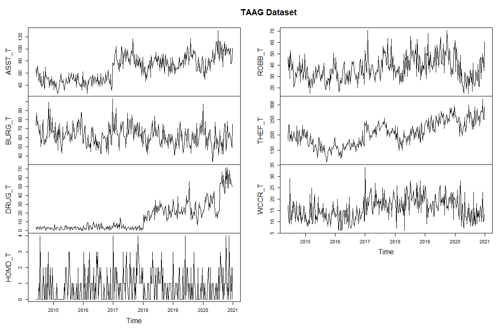

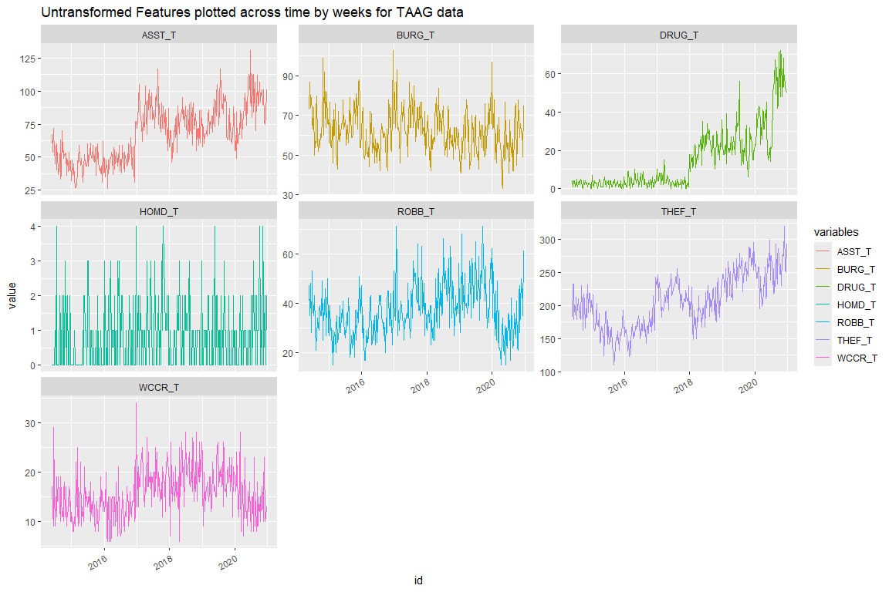

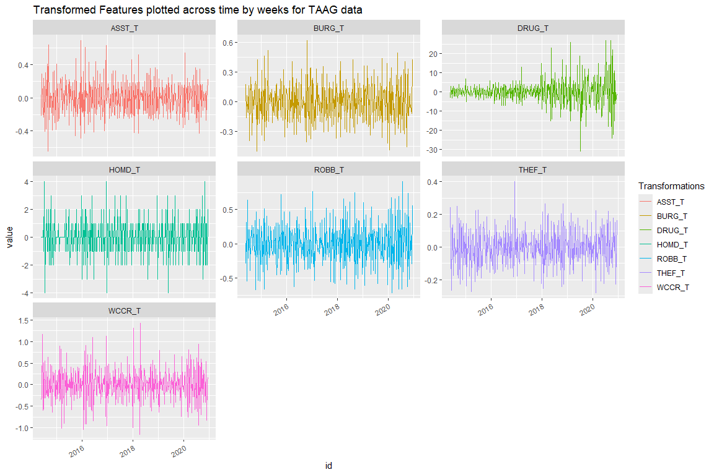

<table style="NAborder-bottom: 0; margin-left: auto; margin-right: auto;" class="table">
<caption>
stationary or not?
</caption>
<thead>
<tr>
<th style="text-align:left;">
</th>
<th style="text-align:left;">
Dickey-Fuller
</th>
<th style="text-align:left;">
Truncation lag parameter
</th>
<th style="text-align:center;">
p-value
</th>
</tr>
</thead>
<tbody>
<tr>
<td style="text-align:left;">
ASST_T_diff(log)
</td>
<td style="text-align:left;">
-39.75676
</td>
<td style="text-align:left;">
5
</td>
<td style="text-align:center;">
0.01
</td>
</tr>
<tr>
<td style="text-align:left;">
BURG_T_diff(log)
</td>
<td style="text-align:left;">
-36.69492
</td>
<td style="text-align:left;">
5
</td>
<td style="text-align:center;">
0.01
</td>
</tr>
<tr>
<td style="text-align:left;">
DRUG_T_diff()
</td>
<td style="text-align:left;">
-33.68827
</td>
<td style="text-align:left;">
5
</td>
<td style="text-align:center;">
0.01
</td>
</tr>
<tr>
<td style="text-align:left;">
HOMD_T_diff()
</td>
<td style="text-align:left;">
-49.28785
</td>
<td style="text-align:left;">
5
</td>
<td style="text-align:center;">
0.01
</td>
</tr>
<tr>
<td style="text-align:left;">
ROBB_T_diff(log)
</td>
<td style="text-align:left;">
-39.79157
</td>
<td style="text-align:left;">
5
</td>
<td style="text-align:center;">
0.01
</td>
</tr>
<tr>
<td style="text-align:left;">
THEF_T_diff(log)
</td>
<td style="text-align:left;">
-35.24954
</td>
<td style="text-align:left;">
5
</td>
<td style="text-align:center;">
0.01
</td>
</tr>
<tr>
<td style="text-align:left;">
WCCR_T_diff(log)
</td>
<td style="text-align:left;">
-54.21746
</td>
<td style="text-align:left;">
5
</td>
<td style="text-align:center;">
0.01
</td>
</tr>
</tbody>
<tfoot>
<tr>
<td style="padding: 0; " colspan="100%">
Note: 
</td>
</tr>
<tr>
<td style="padding: 0; " colspan="100%">
 Test used Phillips-Perron Test for Unit Roots
</td>
</tr>
<tr>
<td style="padding: 0; " colspan="100%">
1 P-value \< 0.05 means data is stationary
</td>
</tr>
<tr>
<td style="padding: 0; " colspan="100%">
2 P-value \> 0.05 means data is not stationary so try a
different method.
</td>
</tr>
</tfoot>
</table>
<table class="table" style="margin-left: auto; margin-right: auto;">
<caption>
Table of Features and the Transformations Applied on Weekly TAAG data
</caption>
<thead>
<tr>
<th style="text-align:left;">
Variable_W
</th>
<th style="text-align:left;">
Description_W
</th>
<th style="text-align:left;">
Transformation_Applied_W
</th>
</tr>
</thead>
<tbody>
<tr>
<td style="text-align:left;">
ASST_T
</td>
<td style="text-align:left;">
Assault related Crimes in all of DALLAS
</td>
<td style="text-align:left;">
diff(log)
</td>
</tr>
<tr>
<td style="text-align:left;">
BURG_T
</td>
<td style="text-align:left;">
Burglary related Crimes in all of DALLAS
</td>
<td style="text-align:left;">
diff(log)
</td>
</tr>
<tr>
<td style="text-align:left;">
DRUG_T
</td>
<td style="text-align:left;">
Drug related Crimes in all of DALLAS
</td>
<td style="text-align:left;">
diff()
</td>
</tr>
<tr>
<td style="text-align:left;">
HOMD_T
</td>
<td style="text-align:left;">
Homicide related Crimes in all of DALLAS
</td>
<td style="text-align:left;">
diff()
</td>
</tr>
<tr>
<td style="text-align:left;">
ROBB_T
</td>
<td style="text-align:left;">
Robbery related Crimes in all of DALLAS
</td>
<td style="text-align:left;">
diff(log)
</td>
</tr>
<tr>
<td style="text-align:left;">
THEF_T
</td>
<td style="text-align:left;">
Theft related Crimes in all of DALLAS
</td>
<td style="text-align:left;">
diff(log)
</td>
</tr>
<tr>
<td style="text-align:left;">
WCCR_T
</td>
<td style="text-align:left;">
White Collar related Crimes in all of DALLAS
</td>
<td style="text-align:left;">
diff(log)
</td>
</tr>
</tbody>
</table>
**non taag weekly**

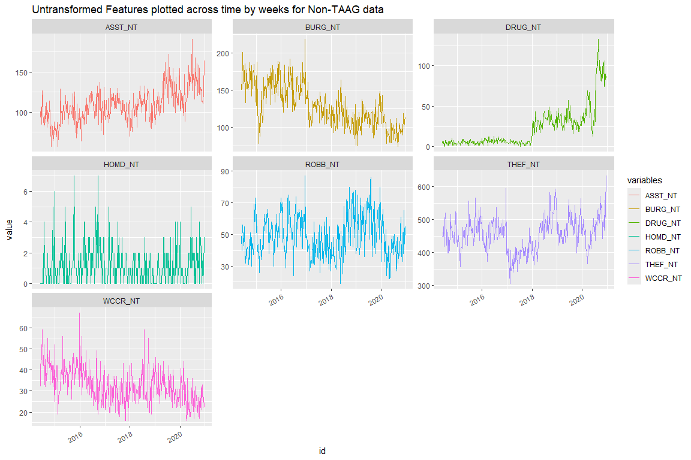

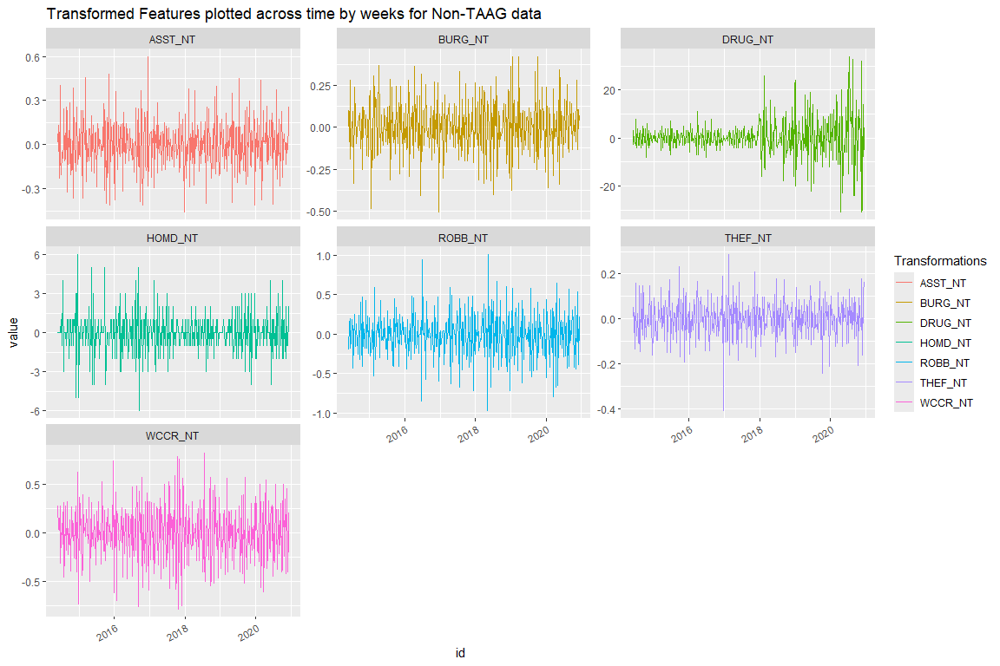

<table style="NAborder-bottom: 0; margin-left: auto; margin-right: auto;" class="table">
<caption>
stationary or not?
</caption>
<thead>
<tr>
<th style="text-align:left;">
</th>
<th style="text-align:left;">
Dickey-Fuller
</th>
<th style="text-align:left;">
Truncation lag parameter
</th>
<th style="text-align:center;">
p-value
</th>
</tr>
</thead>
<tbody>
<tr>
<td style="text-align:left;">
ASST_NT_diff(log)
</td>
<td style="text-align:left;">
-41.54930
</td>
<td style="text-align:left;">
5
</td>
<td style="text-align:center;">
0.01
</td>
</tr>
<tr>
<td style="text-align:left;">
BURG_NT_diff(log)
</td>
<td style="text-align:left;">
-39.03523
</td>
<td style="text-align:left;">
5
</td>
<td style="text-align:center;">
0.01
</td>
</tr>
<tr>
<td style="text-align:left;">
DRUG_NT_diff()
</td>
<td style="text-align:left;">
-28.84832
</td>
<td style="text-align:left;">
5
</td>
<td style="text-align:center;">
0.01
</td>
</tr>
<tr>
<td style="text-align:left;">
HOMD_NT_diff()
</td>
<td style="text-align:left;">
-47.22122
</td>
<td style="text-align:left;">
5
</td>
<td style="text-align:center;">
0.01
</td>
</tr>
<tr>
<td style="text-align:left;">
ROBB_NT_diff(log)
</td>
<td style="text-align:left;">
-42.84342
</td>
<td style="text-align:left;">
5
</td>
<td style="text-align:center;">
0.01
</td>
</tr>
<tr>
<td style="text-align:left;">
THEF_NT_diff(log)
</td>
<td style="text-align:left;">
-32.49152
</td>
<td style="text-align:left;">
5
</td>
<td style="text-align:center;">
0.01
</td>
</tr>
<tr>
<td style="text-align:left;">
WCCR_NT_diff(log)
</td>
<td style="text-align:left;">
-47.87053
</td>
<td style="text-align:left;">
5
</td>
<td style="text-align:center;">
0.01
</td>
</tr>
</tbody>
<tfoot>
<tr>
<td style="padding: 0; " colspan="100%">
Note: 
</td>
</tr>
<tr>
<td style="padding: 0; " colspan="100%">
 Test used Phillips-Perron Test for Unit Roots
</td>
</tr>
<tr>
<td style="padding: 0; " colspan="100%">
1 P-value \< 0.05 means data is stationary
</td>
</tr>
<tr>
<td style="padding: 0; " colspan="100%">
2 P-value \> 0.05 means data is not stationary so try a
different method.
</td>
</tr>
</tfoot>
</table>
<table class="table" style="margin-left: auto; margin-right: auto;">
<caption>
Table of Features and the Transformations Applied on Weekly Non-TAAG
data
</caption>
<thead>
<tr>
<th style="text-align:left;">
Variable_W
</th>
<th style="text-align:left;">
Description_W
</th>
<th style="text-align:left;">
Transformation_Applied_W
</th>
</tr>
</thead>
<tbody>
<tr>
<td style="text-align:left;">
ASST_NT
</td>
<td style="text-align:left;">
Assault related Crimes in all of DALLAS
</td>
<td style="text-align:left;">
diff(log)
</td>
</tr>
<tr>
<td style="text-align:left;">
BURG_NT
</td>
<td style="text-align:left;">
Burglary related Crimes in all of DALLAS
</td>
<td style="text-align:left;">
diff(log)
</td>
</tr>
<tr>
<td style="text-align:left;">
DRUG_NT
</td>
<td style="text-align:left;">
Drug related Crimes in all of DALLAS
</td>
<td style="text-align:left;">
diff()
</td>
</tr>
<tr>
<td style="text-align:left;">
HOMD_NT
</td>
<td style="text-align:left;">
Homicide related Crimes in all of DALLAS
</td>
<td style="text-align:left;">
diff()
</td>
</tr>
<tr>
<td style="text-align:left;">
ROBB_NT
</td>
<td style="text-align:left;">
Robbery related Crimes in all of DALLAS
</td>
<td style="text-align:left;">
diff(log)
</td>
</tr>
<tr>
<td style="text-align:left;">
THEF_NT
</td>
<td style="text-align:left;">
Theft related Crimes in all of DALLAS
</td>
<td style="text-align:left;">
diff(log)
</td>
</tr>
<tr>
<td style="text-align:left;">
WCCR_NT
</td>
<td style="text-align:left;">
White Collar related Crimes in all of DALLAS
</td>
<td style="text-align:left;">
diff(log)
</td>
</tr>
</tbody>
</table>
**overall - weekly**

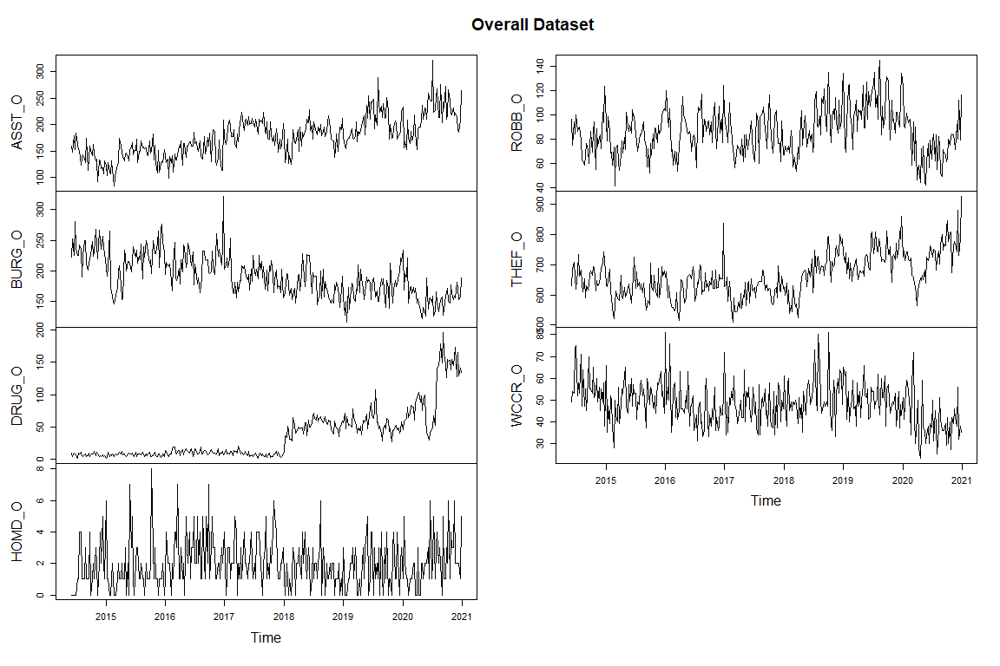

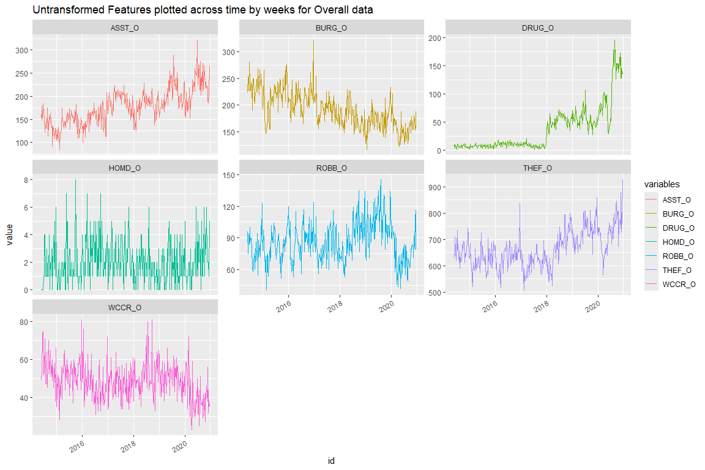

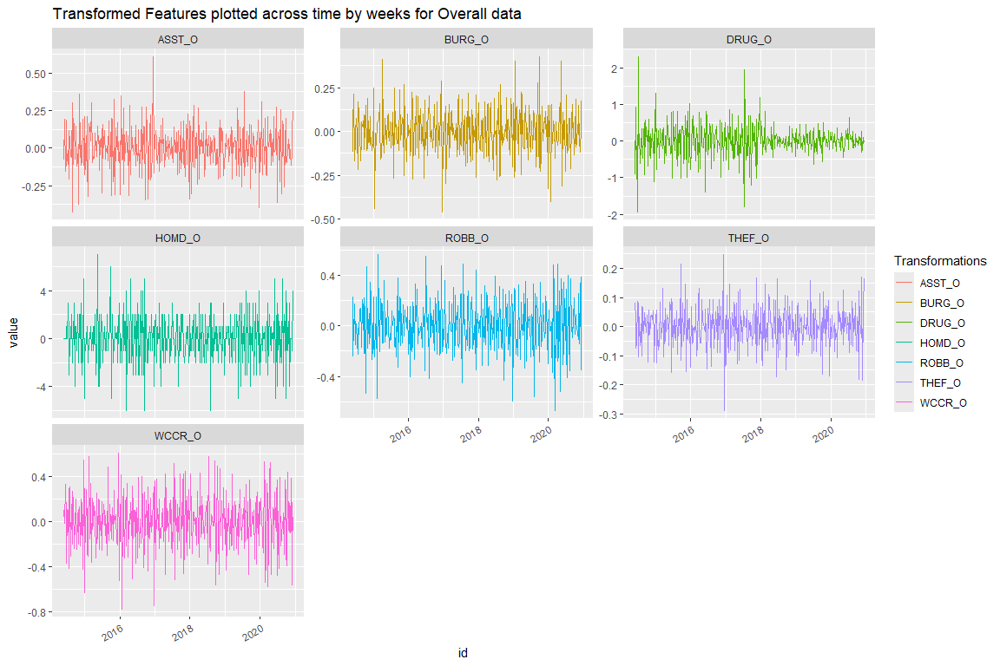

<table style="NAborder-bottom: 0; margin-left: auto; margin-right: auto;" class="table">
<caption>
stationary or not?
</caption>
<thead>
<tr>
<th style="text-align:left;">
</th>
<th style="text-align:left;">
Dickey-Fuller
</th>
<th style="text-align:left;">
Truncation lag parameter
</th>
<th style="text-align:center;">
p-value
</th>
</tr>
</thead>
<tbody>
<tr>
<td style="text-align:left;">
ASST_O_diff(log)
</td>
<td style="text-align:left;">
-37.44572
</td>
<td style="text-align:left;">
5
</td>
<td style="text-align:center;">
0.01
</td>
</tr>
<tr>
<td style="text-align:left;">
BURG_O_diff(log)
</td>
<td style="text-align:left;">
-35.83072
</td>
<td style="text-align:left;">
5
</td>
<td style="text-align:center;">
0.01
</td>
</tr>
<tr>
<td style="text-align:left;">
DRUG_O_diff(log)
</td>
<td style="text-align:left;">
-35.52895
</td>
<td style="text-align:left;">
5
</td>
<td style="text-align:center;">
0.01
</td>
</tr>
<tr>
<td style="text-align:left;">
HOMD_O_diff()
</td>
<td style="text-align:left;">
-48.79419
</td>
<td style="text-align:left;">
5
</td>
<td style="text-align:center;">
0.01
</td>
</tr>
<tr>
<td style="text-align:left;">
ROBB_O_diff(log)
</td>
<td style="text-align:left;">
-36.90690
</td>
<td style="text-align:left;">
5
</td>
<td style="text-align:center;">
0.01
</td>
</tr>
<tr>
<td style="text-align:left;">
THEF_O_diff(log)
</td>
<td style="text-align:left;">
-33.36883
</td>
<td style="text-align:left;">
5
</td>
<td style="text-align:center;">
0.01
</td>
</tr>
<tr>
<td style="text-align:left;">
WCCR_O_diff(log)
</td>
<td style="text-align:left;">
-50.06764
</td>
<td style="text-align:left;">
5
</td>
<td style="text-align:center;">
0.01
</td>
</tr>
</tbody>
<tfoot>
<tr>
<td style="padding: 0; " colspan="100%">
Note: 
</td>
</tr>
<tr>
<td style="padding: 0; " colspan="100%">
 Test used Phillips-Perron Test for Unit Roots
</td>
</tr>
<tr>
<td style="padding: 0; " colspan="100%">
1 P-value \< 0.05 means data is stationary
</td>
</tr>
<tr>
<td style="padding: 0; " colspan="100%">
2 P-value \> 0.05 means data is not stationary so try a
different method.
</td>
</tr>
</tfoot>
</table>
<table class="table" style="margin-left: auto; margin-right: auto;">
<caption>
Table of Features and the Transformations Applied on Weekly Overall data
</caption>
<thead>
<tr>
<th style="text-align:left;">
Variable_W
</th>
<th style="text-align:left;">
Description_W
</th>
<th style="text-align:left;">
Transformation_Applied_W
</th>
</tr>
</thead>
<tbody>
<tr>
<td style="text-align:left;">
ASST_O
</td>
<td style="text-align:left;">
Assault related Crimes in all of DALLAS
</td>
<td style="text-align:left;">
diff(log)
</td>
</tr>
<tr>
<td style="text-align:left;">
BURG_O
</td>
<td style="text-align:left;">
Burglary related Crimes in all of DALLAS
</td>
<td style="text-align:left;">
diff(log)
</td>
</tr>
<tr>
<td style="text-align:left;">
DRUG_O
</td>
<td style="text-align:left;">
Drug related Crimes in all of DALLAS
</td>
<td style="text-align:left;">
diff(log)
</td>
</tr>
<tr>
<td style="text-align:left;">
HOMD_O
</td>
<td style="text-align:left;">
Homicide related Crimes in all of DALLAS
</td>
<td style="text-align:left;">
diff()
</td>
</tr>
<tr>
<td style="text-align:left;">
ROBB_O
</td>
<td style="text-align:left;">
Robbery related Crimes in all of DALLAS
</td>
<td style="text-align:left;">
diff(log)
</td>
</tr>
<tr>
<td style="text-align:left;">
THEF_O
</td>
<td style="text-align:left;">
Theft related Crimes in all of DALLAS
</td>
<td style="text-align:left;">
diff(log)
</td>
</tr>
<tr>
<td style="text-align:left;">
WCCR_O
</td>
<td style="text-align:left;">
White Collar related Crimes in all of DALLAS
</td>
<td style="text-align:left;">
diff(log)
</td>
</tr>
</tbody>
</table>

**full models** **TAAG**

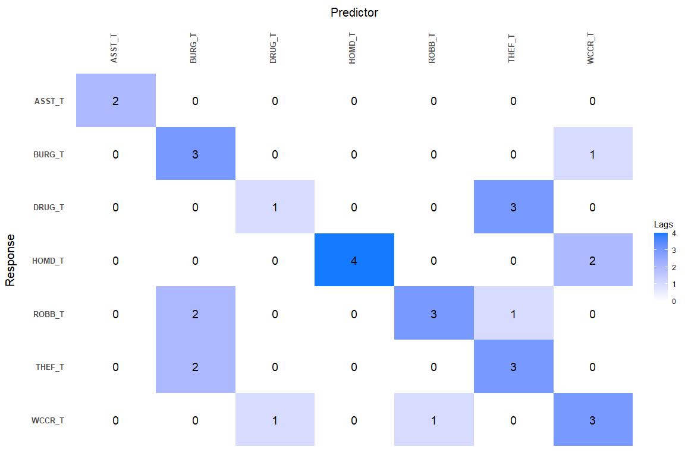

<table class="table table-bordered table-condensed" style="font-size: 12px; width: auto !important; margin-left: auto; margin-right: auto;">
<caption style="font-size: initial !important;">
TAAG model response variable is Assault
</caption>
<thead>
<tr>
<th style="text-align:left;">
Variables
</th>
<th style="text-align:right;">
Coefficients
</th>
</tr>
</thead>
<tbody>
<tr>
<td style="text-align:left;">
ASST_T: Lag 1
</td>
<td style="text-align:right;">
-0.4675
</td>
</tr>
<tr>
<td style="text-align:left;">
ASST_T: Lag 2
</td>
<td style="text-align:right;">
-0.1433
</td>
</tr>
<tr>
<td style="text-align:left;">
Intercept
</td>
<td style="text-align:right;">
0.0063
</td>
</tr>
</tbody>
</table>
<table class="table table-bordered table-condensed" style="font-size: 12px; width: auto !important; margin-left: auto; margin-right: auto;">
<caption style="font-size: initial !important;">
TAAG model response variable is Burglary
</caption>
<thead>
<tr>
<th style="text-align:left;">
Variables
</th>
<th style="text-align:right;">
Coefficients
</th>
</tr>
</thead>
<tbody>
<tr>
<td style="text-align:left;">
BURG_T: Lag 1
</td>
<td style="text-align:right;">
-0.3957
</td>
</tr>
<tr>
<td style="text-align:left;">
WCCR_T: Lag 1
</td>
<td style="text-align:right;">
-0.0237
</td>
</tr>
<tr>
<td style="text-align:left;">
BURG_T: Lag 2
</td>
<td style="text-align:right;">
-0.1064
</td>
</tr>
<tr>
<td style="text-align:left;">
BURG_T: Lag 3
</td>
<td style="text-align:right;">
-0.0138
</td>
</tr>
<tr>
<td style="text-align:left;">
Intercept
</td>
<td style="text-align:right;">
-0.0022
</td>
</tr>
</tbody>
</table>
<table class="table table-bordered table-condensed" style="font-size: 12px; width: auto !important; margin-left: auto; margin-right: auto;">
<caption style="font-size: initial !important;">
TAAG model response variable is Drug
</caption>
<thead>
<tr>
<th style="text-align:left;">
Variables
</th>
<th style="text-align:right;">
Coefficients
</th>
</tr>
</thead>
<tbody>
<tr>
<td style="text-align:left;">
DRUG_T: Lag 1
</td>
<td style="text-align:right;">
-0.3786
</td>
</tr>
<tr>
<td style="text-align:left;">
THEF_T: Lag 1
</td>
<td style="text-align:right;">
-0.0107
</td>
</tr>
<tr>
<td style="text-align:left;">
THEF_T: Lag 2
</td>
<td style="text-align:right;">
0.0032
</td>
</tr>
<tr>
<td style="text-align:left;">
THEF_T: Lag 3
</td>
<td style="text-align:right;">
-0.0001
</td>
</tr>
<tr>
<td style="text-align:left;">
Intercept
</td>
<td style="text-align:right;">
0.0031
</td>
</tr>
</tbody>
</table>
<table class="table table-bordered table-condensed" style="font-size: 12px; width: auto !important; margin-left: auto; margin-right: auto;">
<caption style="font-size: initial !important;">
TAAG model response variable is Homicide
</caption>
<thead>
<tr>
<th style="text-align:left;">
Variables
</th>
<th style="text-align:right;">
Coefficients
</th>
</tr>
</thead>
<tbody>
<tr>
<td style="text-align:left;">
HOMD_T: Lag 1
</td>
<td style="text-align:right;">
-0.4858
</td>
</tr>
<tr>
<td style="text-align:left;">
WCCR_T: Lag 1
</td>
<td style="text-align:right;">
0.0398
</td>
</tr>
<tr>
<td style="text-align:left;">
HOMD_T: Lag 2
</td>
<td style="text-align:right;">
-0.1741
</td>
</tr>
<tr>
<td style="text-align:left;">
WCCR_T: Lag 2
</td>
<td style="text-align:right;">
-0.0253
</td>
</tr>
<tr>
<td style="text-align:left;">
HOMD_T: Lag 3
</td>
<td style="text-align:right;">
-0.0185
</td>
</tr>
<tr>
<td style="text-align:left;">
HOMD_T: Lag 4
</td>
<td style="text-align:right;">
-0.0037
</td>
</tr>
<tr>
<td style="text-align:left;">
Intercept
</td>
<td style="text-align:right;">
-0.0026
</td>
</tr>
</tbody>
</table>
<table class="table table-bordered table-condensed" style="font-size: 12px; width: auto !important; margin-left: auto; margin-right: auto;">
<caption style="font-size: initial !important;">
TAAG model response variable is Robbery
</caption>
<thead>
<tr>
<th style="text-align:left;">
Variables
</th>
<th style="text-align:right;">
Coefficients
</th>
</tr>
</thead>
<tbody>
<tr>
<td style="text-align:left;">
BURG_T: Lag 1
</td>
<td style="text-align:right;">
-0.0090
</td>
</tr>
<tr>
<td style="text-align:left;">
ROBB_T: Lag 1
</td>
<td style="text-align:right;">
-0.4813
</td>
</tr>
<tr>
<td style="text-align:left;">
THEF_T: Lag 1
</td>
<td style="text-align:right;">
0.0068
</td>
</tr>
<tr>
<td style="text-align:left;">
BURG_T: Lag 2
</td>
<td style="text-align:right;">
0.0015
</td>
</tr>
<tr>
<td style="text-align:left;">
ROBB_T: Lag 2
</td>
<td style="text-align:right;">
-0.1624
</td>
</tr>
<tr>
<td style="text-align:left;">
ROBB_T: Lag 3
</td>
<td style="text-align:right;">
-0.0376
</td>
</tr>
<tr>
<td style="text-align:left;">
Intercept
</td>
<td style="text-align:right;">
0.0035
</td>
</tr>
</tbody>
</table>
<table class="table table-bordered table-condensed" style="font-size: 12px; width: auto !important; margin-left: auto; margin-right: auto;">
<caption style="font-size: initial !important;">
TAAG model response variable is Theft
</caption>
<thead>
<tr>
<th style="text-align:left;">
Variables
</th>
<th style="text-align:right;">
Coefficients
</th>
</tr>
</thead>
<tbody>
<tr>
<td style="text-align:left;">
BURG_T: Lag 1
</td>
<td style="text-align:right;">
-0.0074
</td>
</tr>
<tr>
<td style="text-align:left;">
THEF_T: Lag 1
</td>
<td style="text-align:right;">
-0.3749
</td>
</tr>
<tr>
<td style="text-align:left;">
BURG_T: Lag 2
</td>
<td style="text-align:right;">
0.0016
</td>
</tr>
<tr>
<td style="text-align:left;">
THEF_T: Lag 2
</td>
<td style="text-align:right;">
-0.1162
</td>
</tr>
<tr>
<td style="text-align:left;">
THEF_T: Lag 3
</td>
<td style="text-align:right;">
-0.0127
</td>
</tr>
<tr>
<td style="text-align:left;">
Intercept
</td>
<td style="text-align:right;">
-0.0068
</td>
</tr>
</tbody>
</table>
<table class="table table-bordered table-condensed" style="font-size: 12px; width: auto !important; margin-left: auto; margin-right: auto;">
<caption style="font-size: initial !important;">
TAAG model response variable is White Collar Crime
</caption>
<thead>
<tr>
<th style="text-align:left;">
Variables
</th>
<th style="text-align:right;">
Coefficients
</th>
</tr>
</thead>
<tbody>
<tr>
<td style="text-align:left;">
DRUG_T: Lag 1
</td>
<td style="text-align:right;">
-0.0121
</td>
</tr>
<tr>
<td style="text-align:left;">
ROBB_T: Lag 1
</td>
<td style="text-align:right;">
0.0167
</td>
</tr>
<tr>
<td style="text-align:left;">
WCCR_T: Lag 1
</td>
<td style="text-align:right;">
-0.5782
</td>
</tr>
<tr>
<td style="text-align:left;">
WCCR_T: Lag 2
</td>
<td style="text-align:right;">
-0.2086
</td>
</tr>
<tr>
<td style="text-align:left;">
WCCR_T: Lag 3
</td>
<td style="text-align:right;">
-0.0397
</td>
</tr>
<tr>
<td style="text-align:left;">
Intercept
</td>
<td style="text-align:right;">
0.0007
</td>
</tr>
</tbody>
</table>
**Non-TAAG**  
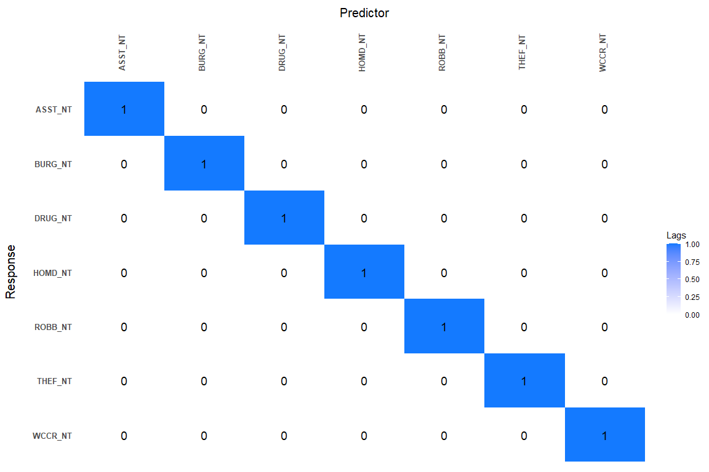

<table class="table table-bordered table-condensed" style="font-size: 12px; width: auto !important; margin-left: auto; margin-right: auto;">
<caption style="font-size: initial !important;">
Non-TAAG model response variable is Assault
</caption>
<thead>
<tr>
<th style="text-align:left;">
Variables
</th>
<th style="text-align:right;">
Coefficients
</th>
</tr>
</thead>
<tbody>
<tr>
<td style="text-align:left;">
ASST_NT: Lag 1
</td>
<td style="text-align:right;">
-0.2561
</td>
</tr>
<tr>
<td style="text-align:left;">
Intercept
</td>
<td style="text-align:right;">
0.0070
</td>
</tr>
</tbody>
</table>
<table class="table table-bordered table-condensed" style="font-size: 12px; width: auto !important; margin-left: auto; margin-right: auto;">
<caption style="font-size: initial !important;">
Non-TAAG model response variable is Burglary
</caption>
<thead>
<tr>
<th style="text-align:left;">
Variables
</th>
<th style="text-align:right;">
Coefficients
</th>
</tr>
</thead>
<tbody>
<tr>
<td style="text-align:left;">
BURG_NT: Lag 1
</td>
<td style="text-align:right;">
-0.2575
</td>
</tr>
<tr>
<td style="text-align:left;">
Intercept
</td>
<td style="text-align:right;">
-0.0055
</td>
</tr>
</tbody>
</table>
<table class="table table-bordered table-condensed" style="font-size: 12px; width: auto !important; margin-left: auto; margin-right: auto;">
<caption style="font-size: initial !important;">
Non-TAAG model response variable is Drug
</caption>
<thead>
<tr>
<th style="text-align:left;">
Variables
</th>
<th style="text-align:right;">
Coefficients
</th>
</tr>
</thead>
<tbody>
<tr>
<td style="text-align:left;">
DRUG_NT: Lag 1
</td>
<td style="text-align:right;">
-0.2339
</td>
</tr>
<tr>
<td style="text-align:left;">
Intercept
</td>
<td style="text-align:right;">
0.0045
</td>
</tr>
</tbody>
</table>
<table class="table table-bordered table-condensed" style="font-size: 12px; width: auto !important; margin-left: auto; margin-right: auto;">
<caption style="font-size: initial !important;">
Non-TAAG model response variable is Homicide
</caption>
<thead>
<tr>
<th style="text-align:left;">
Variables
</th>
<th style="text-align:right;">
Coefficients
</th>
</tr>
</thead>
<tbody>
<tr>
<td style="text-align:left;">
HOMD_NT: Lag 1
</td>
<td style="text-align:right;">
-0.3397
</td>
</tr>
<tr>
<td style="text-align:left;">
Intercept
</td>
<td style="text-align:right;">
-0.0115
</td>
</tr>
</tbody>
</table>
<table class="table table-bordered table-condensed" style="font-size: 12px; width: auto !important; margin-left: auto; margin-right: auto;">
<caption style="font-size: initial !important;">
Non-TAAG model response variable is Robbery
</caption>
<thead>
<tr>
<th style="text-align:left;">
Variables
</th>
<th style="text-align:right;">
Coefficients
</th>
</tr>
</thead>
<tbody>
<tr>
<td style="text-align:left;">
ROBB_NT: Lag 1
</td>
<td style="text-align:right;">
-0.320
</td>
</tr>
<tr>
<td style="text-align:left;">
Intercept
</td>
<td style="text-align:right;">
-0.004
</td>
</tr>
</tbody>
</table>
<table class="table table-bordered table-condensed" style="font-size: 12px; width: auto !important; margin-left: auto; margin-right: auto;">
<caption style="font-size: initial !important;">
Non-TAAG model response variable is Theft
</caption>
<thead>
<tr>
<th style="text-align:left;">
Variables
</th>
<th style="text-align:right;">
Coefficients
</th>
</tr>
</thead>
<tbody>
<tr>
<td style="text-align:left;">
THEF_NT: Lag 1
</td>
<td style="text-align:right;">
-0.1696
</td>
</tr>
<tr>
<td style="text-align:left;">
Intercept
</td>
<td style="text-align:right;">
-0.0035
</td>
</tr>
</tbody>
</table>
<table class="table table-bordered table-condensed" style="font-size: 12px; width: auto !important; margin-left: auto; margin-right: auto;">
<caption style="font-size: initial !important;">
Non-TAAG model response variable is White Collar Crime
</caption>
<thead>
<tr>
<th style="text-align:left;">
Variables
</th>
<th style="text-align:right;">
Coefficients
</th>
</tr>
</thead>
<tbody>
<tr>
<td style="text-align:left;">
WCCR_NT: Lag 1
</td>
<td style="text-align:right;">
-0.3026
</td>
</tr>
<tr>
<td style="text-align:left;">
Intercept
</td>
<td style="text-align:right;">
-0.0006
</td>
</tr>
</tbody>
</table>
**Overall**

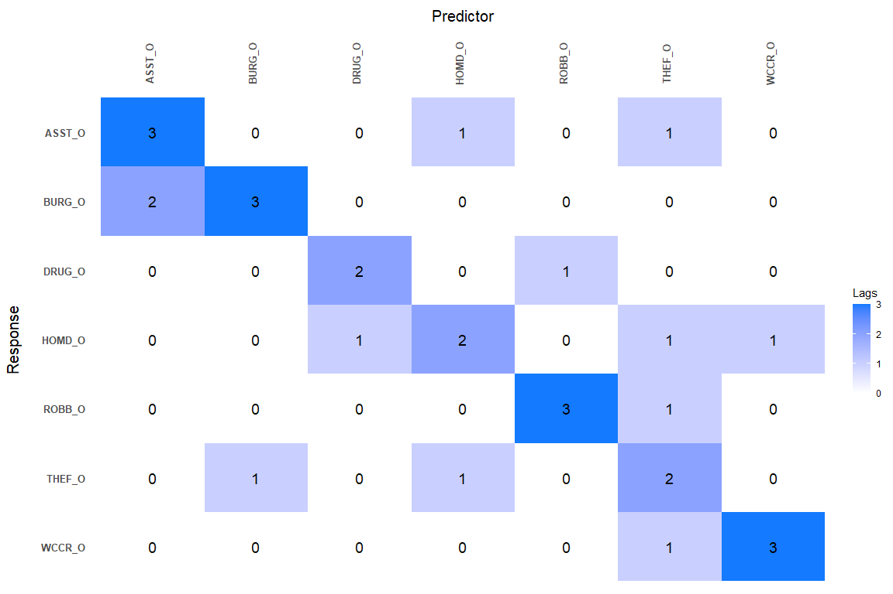

<table class="table table-bordered table-condensed" style="font-size: 12px; width: auto !important; margin-left: auto; margin-right: auto;">
<caption style="font-size: initial !important;">
Overall model response variable is Assault
</caption>
<thead>
<tr>
<th style="text-align:left;">
Variables
</th>
<th style="text-align:right;">
Coefficients
</th>
</tr>
</thead>
<tbody>
<tr>
<td style="text-align:left;">
ASST_O: Lag 1
</td>
<td style="text-align:right;">
-0.4317
</td>
</tr>
<tr>
<td style="text-align:left;">
HOMD_O: Lag 1
</td>
<td style="text-align:right;">
0.0335
</td>
</tr>
<tr>
<td style="text-align:left;">
THEF_O: Lag 1
</td>
<td style="text-align:right;">
0.0162
</td>
</tr>
<tr>
<td style="text-align:left;">
ASST_O: Lag 2
</td>
<td style="text-align:right;">
-0.1677
</td>
</tr>
<tr>
<td style="text-align:left;">
ASST_O: Lag 3
</td>
<td style="text-align:right;">
-0.0210
</td>
</tr>
<tr>
<td style="text-align:left;">
Intercept
</td>
<td style="text-align:right;">
0.0081
</td>
</tr>
</tbody>
</table>
<table class="table table-bordered table-condensed" style="font-size: 12px; width: auto !important; margin-left: auto; margin-right: auto;">
<caption style="font-size: initial !important;">
Overall model response variable is Burglary
</caption>
<thead>
<tr>
<th style="text-align:left;">
Variables
</th>
<th style="text-align:right;">
Coefficients
</th>
</tr>
</thead>
<tbody>
<tr>
<td style="text-align:left;">
ASST_O: Lag 1
</td>
<td style="text-align:right;">
-0.0617
</td>
</tr>
<tr>
<td style="text-align:left;">
BURG_O: Lag 1
</td>
<td style="text-align:right;">
-0.3827
</td>
</tr>
<tr>
<td style="text-align:left;">
ASST_O: Lag 2
</td>
<td style="text-align:right;">
-0.0007
</td>
</tr>
<tr>
<td style="text-align:left;">
BURG_O: Lag 2
</td>
<td style="text-align:right;">
-0.1340
</td>
</tr>
<tr>
<td style="text-align:left;">
BURG_O: Lag 3
</td>
<td style="text-align:right;">
-0.0282
</td>
</tr>
<tr>
<td style="text-align:left;">
Intercept
</td>
<td style="text-align:right;">
-0.0069
</td>
</tr>
</tbody>
</table>
<table class="table table-bordered table-condensed" style="font-size: 12px; width: auto !important; margin-left: auto; margin-right: auto;">
<caption style="font-size: initial !important;">
Overall model response variable is Drug
</caption>
<thead>
<tr>
<th style="text-align:left;">
Variables
</th>
<th style="text-align:right;">
Coefficients
</th>
</tr>
</thead>
<tbody>
<tr>
<td style="text-align:left;">
DRUG_O: Lag 1
</td>
<td style="text-align:right;">
-0.3451
</td>
</tr>
<tr>
<td style="text-align:left;">
ROBB_O: Lag 1
</td>
<td style="text-align:right;">
-0.0078
</td>
</tr>
<tr>
<td style="text-align:left;">
DRUG_O: Lag 2
</td>
<td style="text-align:right;">
-0.1706
</td>
</tr>
<tr>
<td style="text-align:left;">
Intercept
</td>
<td style="text-align:right;">
0.0069
</td>
</tr>
</tbody>
</table>
<table class="table table-bordered table-condensed" style="font-size: 12px; width: auto !important; margin-left: auto; margin-right: auto;">
<caption style="font-size: initial !important;">
Overall model response variable is Homicide
</caption>
<thead>
<tr>
<th style="text-align:left;">
Variables
</th>
<th style="text-align:right;">
Coefficients
</th>
</tr>
</thead>
<tbody>
<tr>
<td style="text-align:left;">
DRUG_O: Lag 1
</td>
<td style="text-align:right;">
-0.0013
</td>
</tr>
<tr>
<td style="text-align:left;">
HOMD_O: Lag 1
</td>
<td style="text-align:right;">
-0.5639
</td>
</tr>
<tr>
<td style="text-align:left;">
THEF_O: Lag 1
</td>
<td style="text-align:right;">
0.0033
</td>
</tr>
<tr>
<td style="text-align:left;">
WCCR_O: Lag 1
</td>
<td style="text-align:right;">
0.0072
</td>
</tr>
<tr>
<td style="text-align:left;">
HOMD_O: Lag 2
</td>
<td style="text-align:right;">
-0.1937
</td>
</tr>
<tr>
<td style="text-align:left;">
Intercept
</td>
<td style="text-align:right;">
-0.0135
</td>
</tr>
</tbody>
</table>
<table class="table table-bordered table-condensed" style="font-size: 12px; width: auto !important; margin-left: auto; margin-right: auto;">
<caption style="font-size: initial !important;">
Overall model response variable is Robbery
</caption>
<thead>
<tr>
<th style="text-align:left;">
Variables
</th>
<th style="text-align:right;">
Coefficients
</th>
</tr>
</thead>
<tbody>
<tr>
<td style="text-align:left;">
ROBB_O: Lag 1
</td>
<td style="text-align:right;">
-0.4182
</td>
</tr>
<tr>
<td style="text-align:left;">
THEF_O: Lag 1
</td>
<td style="text-align:right;">
0.1040
</td>
</tr>
<tr>
<td style="text-align:left;">
ROBB_O: Lag 2
</td>
<td style="text-align:right;">
-0.1002
</td>
</tr>
<tr>
<td style="text-align:left;">
ROBB_O: Lag 3
</td>
<td style="text-align:right;">
-0.0427
</td>
</tr>
<tr>
<td style="text-align:left;">
Intercept
</td>
<td style="text-align:right;">
-0.0001
</td>
</tr>
</tbody>
</table>
<table class="table table-bordered table-condensed" style="font-size: 12px; width: auto !important; margin-left: auto; margin-right: auto;">
<caption style="font-size: initial !important;">
Overall model response variable is Theft
</caption>
<thead>
<tr>
<th style="text-align:left;">
Variables
</th>
<th style="text-align:right;">
Coefficients
</th>
</tr>
</thead>
<tbody>
<tr>
<td style="text-align:left;">
BURG_O: Lag 1
</td>
<td style="text-align:right;">
-0.0182
</td>
</tr>
<tr>
<td style="text-align:left;">
HOMD_O: Lag 1
</td>
<td style="text-align:right;">
-0.0070
</td>
</tr>
<tr>
<td style="text-align:left;">
THEF_O: Lag 1
</td>
<td style="text-align:right;">
-0.3952
</td>
</tr>
<tr>
<td style="text-align:left;">
THEF_O: Lag 2
</td>
<td style="text-align:right;">
-0.1393
</td>
</tr>
<tr>
<td style="text-align:left;">
Intercept
</td>
<td style="text-align:right;">
-0.0090
</td>
</tr>
</tbody>
</table>
<table class="table table-bordered table-condensed" style="font-size: 12px; width: auto !important; margin-left: auto; margin-right: auto;">
<caption style="font-size: initial !important;">
Overall model response variable is White Collar Crime
</caption>
<thead>
<tr>
<th style="text-align:left;">
Variables
</th>
<th style="text-align:right;">
Coefficients
</th>
</tr>
</thead>
<tbody>
<tr>
<td style="text-align:left;">
THEF_O: Lag 1
</td>
<td style="text-align:right;">
0.0238
</td>
</tr>
<tr>
<td style="text-align:left;">
WCCR_O: Lag 1
</td>
<td style="text-align:right;">
-0.5716
</td>
</tr>
<tr>
<td style="text-align:left;">
WCCR_O: Lag 2
</td>
<td style="text-align:right;">
-0.2551
</td>
</tr>
<tr>
<td style="text-align:left;">
WCCR_O: Lag 3
</td>
<td style="text-align:right;">
-0.1273
</td>
</tr>
<tr>
<td style="text-align:left;">
Intercept
</td>
<td style="text-align:right;">
-0.0001
</td>
</tr>
</tbody>
</table>
**model evaluation**

*out of sample forecast 1 step ahead equation*  

*$RMSE$*  
*$RMSE_i$*  

<table style="NAborder-bottom: 0;border-bottom: 0; margin-left: auto; margin-right: auto;" class="table">
<caption>
Out-Of-Sample model evaluation
</caption>
<thead>
<tr>
<th style="text-align:left;">
</th>
<th style="text-align:right;">
mean(RMSE on TAAG DATA)
</th>
<th style="text-align:right;">
mean(RMSE on NON-TAAG DATA)
</th>
</tr>
</thead>
<tbody>
<tr>
<td style="text-align:left;">
SparseVar_CV_HLAG
</td>
<td style="text-align:right;">
15.68545
</td>
<td style="text-align:right;">
25.99907
</td>
</tr>
<tr>
<td style="text-align:left;">
SparseVar_CV_HLAG_Overall
</td>
<td style="text-align:right;">
19.26385
</td>
<td style="text-align:right;">
28.05909
</td>
</tr>
<tr>
<td style="text-align:left;">
VAR_AIC
</td>
<td style="text-align:right;">
18.21052
</td>
<td style="text-align:right;">
28.76986
</td>
</tr>
<tr>
<td style="text-align:left;">
VAR_AIC_Overall
</td>
<td style="text-align:right;">
19.80248
</td>
<td style="text-align:right;">
29.02669
</td>
</tr>
<tr>
<td style="text-align:left;">
AR(1)
</td>
<td style="text-align:right;">
17.06835
</td>
<td style="text-align:right;">
26.91332
</td>
</tr>
<tr>
<td style="text-align:left;">
AR(1)\_Overall
</td>
<td style="text-align:right;">
19.53949
</td>
<td style="text-align:right;">
28.64023
</td>
</tr>
</tbody>
<tfoot>
<tr>
<td style="padding: 0; " colspan="100%">
Note: 
</td>
</tr>
<tr>
<td style="padding: 0; " colspan="100%">
 Prior probabilities of TAAG/Overall for each crime to get
the forecast of crimes
</td>
</tr>
<tr>
<td style="padding: 0; " colspan="100%">
 in TAAG areas from Overall model forecasted values.
</td>
</tr>
<tr>
<td style="padding: 0; " colspan="100%">
 It follows that the prior probability for Non-TAAG is 1 -
the priors for TAAG/Overall
</td>
</tr>
<tr>
<td style="padding: 0; " colspan="100%">
1 TAAG Prior for Assault: 0.38
</td>
</tr>
<tr>
<td style="padding: 0; " colspan="100%">
2 TAAG Prior for Burglary: 0.32
</td>
</tr>
<tr>
<td style="padding: 0; " colspan="100%">
3 TAAG Prior for Drug: 0.4
</td>
</tr>
<tr>
<td style="padding: 0; " colspan="100%">
4 TAAG Prior for Homicide: 0.41
</td>
</tr>
<tr>
<td style="padding: 0; " colspan="100%">
5 TAAG Prior for Robbery: 0.43
</td>
</tr>
<tr>
<td style="padding: 0; " colspan="100%">
6 TAAG Prior for Theft: 0.3
</td>
</tr>
<tr>
<td style="padding: 0; " colspan="100%">
7 TAAG Prior for White Collar Crime: 0.32
</td>
</tr>
</tfoot>
<tfoot>
<tr>
<td style="padding: 0; " colspan="100%">
Note: 
</td>
</tr>
<tr>
<td style="padding: 0; " colspan="100%">
 Train/Test split ratio 0.8
</td>
</tr>
</tfoot>
</table>
<table style="NAborder-bottom: 0;border-bottom: 0; margin-left: auto; margin-right: auto;" class="table">
<caption>
Out-Of-Sample model evaluation RMSE for TAAG data for each crime
</caption>
<thead>
<tr>
<th style="text-align:left;">
</th>
<th style="text-align:right;">
ASST_T
</th>
<th style="text-align:right;">
BURG_T
</th>
<th style="text-align:right;">
DRUG_T
</th>
<th style="text-align:right;">
HOMD_T
</th>
<th style="text-align:right;">
ROBB_T
</th>
<th style="text-align:right;">
THEF_T
</th>
<th style="text-align:right;">
WCCR_T
</th>
</tr>
</thead>
<tbody>
<tr>
<td style="text-align:left;">
SparseVar_CV_HLAG
</td>
<td style="text-align:right;">
17.10322
</td>
<td style="text-align:right;">
11.69895
</td>
<td style="text-align:right;">
28.56807
</td>
<td style="text-align:right;">
1.322444
</td>
<td style="text-align:right;">
19.08573
</td>
<td style="text-align:right;">
26.15931
</td>
<td style="text-align:right;">
5.860448
</td>
</tr>
<tr>
<td style="text-align:left;">
SparseVar_CV_HLAG_Overall
</td>
<td style="text-align:right;">
21.92370
</td>
<td style="text-align:right;">
15.40216
</td>
<td style="text-align:right;">
30.51437
</td>
<td style="text-align:right;">
1.165267
</td>
<td style="text-align:right;">
14.22669
</td>
<td style="text-align:right;">
44.41859
</td>
<td style="text-align:right;">
7.196149
</td>
</tr>
<tr>
<td style="text-align:left;">
VAR_AIC
</td>
<td style="text-align:right;">
20.83907
</td>
<td style="text-align:right;">
13.79238
</td>
<td style="text-align:right;">
29.96194
</td>
<td style="text-align:right;">
1.629114
</td>
<td style="text-align:right;">
22.44529
</td>
<td style="text-align:right;">
32.16905
</td>
<td style="text-align:right;">
6.636778
</td>
</tr>
<tr>
<td style="text-align:left;">
VAR_AIC_Overall
</td>
<td style="text-align:right;">
22.20559
</td>
<td style="text-align:right;">
16.03347
</td>
<td style="text-align:right;">
30.68316
</td>
<td style="text-align:right;">
1.181782
</td>
<td style="text-align:right;">
14.83752
</td>
<td style="text-align:right;">
45.70529
</td>
<td style="text-align:right;">
7.970517
</td>
</tr>
<tr>
<td style="text-align:left;">
AR(1)
</td>
<td style="text-align:right;">
18.83788
</td>
<td style="text-align:right;">
13.16226
</td>
<td style="text-align:right;">
29.13872
</td>
<td style="text-align:right;">
1.492289
</td>
<td style="text-align:right;">
21.70193
</td>
<td style="text-align:right;">
28.41398
</td>
<td style="text-align:right;">
6.731422
</td>
</tr>
<tr>
<td style="text-align:left;">
AR(1)\_Overall
</td>
<td style="text-align:right;">
22.24183
</td>
<td style="text-align:right;">
15.79020
</td>
<td style="text-align:right;">
30.49776
</td>
<td style="text-align:right;">
1.204358
</td>
<td style="text-align:right;">
14.42627
</td>
<td style="text-align:right;">
45.02993
</td>
<td style="text-align:right;">
7.586116
</td>
</tr>
</tbody>
<tfoot>
<tr>
<td style="padding: 0; " colspan="100%">
Note: 
</td>
</tr>
<tr>
<td style="padding: 0; " colspan="100%">
 Prior probabilities of TAAG/Overall for each crime to get
the forecast of crimes
</td>
</tr>
<tr>
<td style="padding: 0; " colspan="100%">
 in TAAG areas from Overall model forecasted values.
</td>
</tr>
<tr>
<td style="padding: 0; " colspan="100%">
1 TAAG Prior for Assault: 0.38
</td>
</tr>
<tr>
<td style="padding: 0; " colspan="100%">
2 TAAG Prior for Burglary: 0.32
</td>
</tr>
<tr>
<td style="padding: 0; " colspan="100%">
3 TAAG Prior for Drug: 0.4
</td>
</tr>
<tr>
<td style="padding: 0; " colspan="100%">
4 TAAG Prior for Homicide: 0.41
</td>
</tr>
<tr>
<td style="padding: 0; " colspan="100%">
5 TAAG Prior for Robbery: 0.43
</td>
</tr>
<tr>
<td style="padding: 0; " colspan="100%">
6 TAAG Prior for Theft: 0.3
</td>
</tr>
<tr>
<td style="padding: 0; " colspan="100%">
7 TAAG Prior for White Collar Crime: 0.32
</td>
</tr>
</tfoot>
<tfoot>
<tr>
<td style="padding: 0; " colspan="100%">
Note: 
</td>
</tr>
<tr>
<td style="padding: 0; " colspan="100%">
 Train/Test split ratio 0.8
</td>
</tr>
</tfoot>
</table>
<table style="NAborder-bottom: 0;border-bottom: 0; margin-left: auto; margin-right: auto;" class="table">
<caption>
Out-Of-Sample model evaluation RMSE for Non-TAAG data for each crime
</caption>
<thead>
<tr>
<th style="text-align:left;">
</th>
<th style="text-align:right;">
ASST_NT
</th>
<th style="text-align:right;">
BURG_NT
</th>
<th style="text-align:right;">
DRUG_NT
</th>
<th style="text-align:right;">
HOMD_NT
</th>
<th style="text-align:right;">
ROBB_NT
</th>
<th style="text-align:right;">
THEF_NT
</th>
<th style="text-align:right;">
WCCR_NT
</th>
</tr>
</thead>
<tbody>
<tr>
<td style="text-align:left;">
SparseVar_CV_HLag
</td>
<td style="text-align:right;">
22.62760
</td>
<td style="text-align:right;">
24.78445
</td>
<td style="text-align:right;">
50.08702
</td>
<td style="text-align:right;">
1.439145
</td>
<td style="text-align:right;">
18.90340
</td>
<td style="text-align:right;">
50.19170
</td>
<td style="text-align:right;">
13.96014
</td>
</tr>
<tr>
<td style="text-align:left;">
SparseVar_CV_HLAG_Overall
</td>
<td style="text-align:right;">
25.00690
</td>
<td style="text-align:right;">
21.05555
</td>
<td style="text-align:right;">
47.65669
</td>
<td style="text-align:right;">
1.369274
</td>
<td style="text-align:right;">
26.73123
</td>
<td style="text-align:right;">
64.38042
</td>
<td style="text-align:right;">
10.21358
</td>
</tr>
<tr>
<td style="text-align:left;">
VAR_AIC
</td>
<td style="text-align:right;">
24.89668
</td>
<td style="text-align:right;">
26.40771
</td>
<td style="text-align:right;">
52.46025
</td>
<td style="text-align:right;">
1.667385
</td>
<td style="text-align:right;">
22.90393
</td>
<td style="text-align:right;">
57.24167
</td>
<td style="text-align:right;">
15.81140
</td>
</tr>
<tr>
<td style="text-align:left;">
VAR_AIC_Overall
</td>
<td style="text-align:right;">
26.77407
</td>
<td style="text-align:right;">
21.15895
</td>
<td style="text-align:right;">
47.92450
</td>
<td style="text-align:right;">
1.502647
</td>
<td style="text-align:right;">
29.06002
</td>
<td style="text-align:right;">
64.78078
</td>
<td style="text-align:right;">
11.98588
</td>
</tr>
<tr>
<td style="text-align:left;">
AR(1)
</td>
<td style="text-align:right;">
24.43368
</td>
<td style="text-align:right;">
25.77211
</td>
<td style="text-align:right;">
50.29544
</td>
<td style="text-align:right;">
1.535721
</td>
<td style="text-align:right;">
20.10323
</td>
<td style="text-align:right;">
51.52956
</td>
<td style="text-align:right;">
14.72351
</td>
</tr>
<tr>
<td style="text-align:left;">
AR(1)\_Overall
</td>
<td style="text-align:right;">
26.52192
</td>
<td style="text-align:right;">
21.73032
</td>
<td style="text-align:right;">
47.63698
</td>
<td style="text-align:right;">
1.424977
</td>
<td style="text-align:right;">
27.71585
</td>
<td style="text-align:right;">
64.60533
</td>
<td style="text-align:right;">
10.84627
</td>
</tr>
</tbody>
<tfoot>
<tr>
<td style="padding: 0; " colspan="100%">
Note: 
</td>
</tr>
<tr>
<td style="padding: 0; " colspan="100%">
 Prior probabilities of Non-TAAG/Overall for each crime to
get the forecast of crimes
</td>
</tr>
<tr>
<td style="padding: 0; " colspan="100%">
 in Non-TAAG areas from Overall model forecasted values.
</td>
</tr>
<tr>
<td style="padding: 0; " colspan="100%">
1 Non-TAAG Prior for Assault: 0.62
</td>
</tr>
<tr>
<td style="padding: 0; " colspan="100%">
2 Non-TAAG Prior for Burglary: 0.68
</td>
</tr>
<tr>
<td style="padding: 0; " colspan="100%">
3 Non-TAAG Prior for Drug: 0.6
</td>
</tr>
<tr>
<td style="padding: 0; " colspan="100%">
4 Non-TAAG Prior for Homicide: 0.59
</td>
</tr>
<tr>
<td style="padding: 0; " colspan="100%">
5 Non-TAAG Prior for Robbery: 0.57
</td>
</tr>
<tr>
<td style="padding: 0; " colspan="100%">
6 Non-TAAG Prior for Theft: 0.7
</td>
</tr>
<tr>
<td style="padding: 0; " colspan="100%">
7 Non-TAAG Prior for White Collar Crime: 0.68
</td>
</tr>
</tfoot>
<tfoot>
<tr>
<td style="padding: 0; " colspan="100%">
Note: 
</td>
</tr>
<tr>
<td style="padding: 0; " colspan="100%">
 Train/Test split ratio 0.8
</td>
</tr>
</tfoot>
</table>
