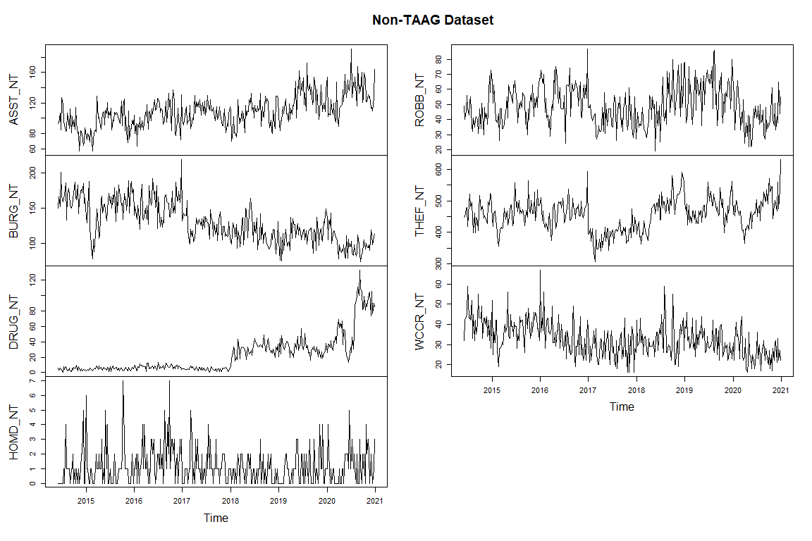

R code forecasting crimes in Dallas
================
John Kenney
11/12/2021

``` r
library(ggplot2)
library(dplyr)
#library(reshape2)
library(kableExtra)
library(reshape2)
library(vars)
#library(mFilter)
#library(tseries)
#library(TSstudio)
library(forecast)
library(tidyverse)
#library(forcats)
library(lubridate)
#library(BBmisc)
#library(glmnet)
library(sparsevar)
library(bigtime)
library(fastDummies)
#set working directory
#setwd("C:/Users/John/Documents/R/Programs/Capstone/")
#setwd("C:/Users/jkenn/OneDrive/Documents/R/capstone/")
#
#setwd("C:/Users/jkenn/OneDrive/Documents/Forecasting-Crimes-in-Dallas-using-actual-DPD-Data/")
#set doDataCleaning to TRUE if you don't have the cleaned data frames already saved in your directory
doDataCleaning <- FALSE
#doDataCleaning <- TRUE
#set train ratio
trainratio <- .8
#WIT stands for Weekly taag data
#WINT stands for weekly non-taag data
#WIO stands for weekly Overall data

#WIT_names contains the a string of the transformations applied to WIT in column order
#WINT_names contains the a string of the transformations applied to WINT in column order
#WIO_names contains the a string of the transformations applied to WIO in column order

#TWIT stands for TAAG data after transforming to stationary
#TWINT stands for non-TAAG data after transforming to stationary
#TWIO stands for Overall data after transforming to stationary

#scaled_TWIT stands for TAAG data scaled to training data and test data scaled using scaled attributes of the training data
#scaled_TWINT stands for non-TAAG data scaled to training data and test data scaled using scaled attributes of the training data
#scaled_TWIO stands for overall data scaled to training data and test data scaled using scaled attributes of the training data


# I have tried to make the code as general as possible where the functions may be able to work with more variables or a different data set but all code with tables probably will have to be tweaked if used with more variables or different data sets
```

**DATA CLEANING**

``` r
if (doDataCleaning) {
    ###################################################################################################################
  ###################################################################################################################
  # Project R File for TAAG
  ###################################################################################################################
  ###################################################################################################################

  
  #########################################################################
  # Read in data and select relevant columns
  # Lines 30-41
  #########################################################################
  {
    
    # Incidents
    inc <- read.csv("Data/Police_Incidents1.csv")
    
    # Retrieve TAAG's, date of occurrence, offense description, crime category, type of victim, gender of victim
    pin <- inc %>% dplyr::select(Target.Area.Action.Grids, Date1.of.Occurrence, UCR.Offense.Description, NIBRS.Crime.Category,Day1.of.the.Year, Month1.of.Occurence)
    # Write result to a new csv file
    #write.csv(pin,file = "pin_new.csv", row.names=FALSE, quote=FALSE)
  }
  
  pin$NIBRS.Crime.Category %>% unique()
  pin$UCR.Offense.Description %>% unique() 
  
  #########################################################################
  # Provide appropriate abbreviations and labels for each column
  # Lines 48- 113
  #########################################################################
  {
    # Provide abbreviations for each category of crime, group similar crimes into one category
    pin$NIBRS.Crime.Category <- pin$NIBRS.Crime.Category %>%
      fct_collapse(ALCH = c("DRIVING UNDER THE INFLUENCE", "PUBLIC INTOXICATION", "LIQUOR LAW VIOLATIONS"),
                   ASST = c("ASSAULT OFFENSES"),
                   ROBB = c("ROBBERY"),
                   BURG = c("BURGLARY/ BREAKING & ENTERING"),
                   THEF = c("LARCENY/ THEFT OFFENSES",
                            "STOLEN PROPERTY OFFENSES", "MOTOR VEHICLE THEFT"),
                   #MVTF = c("MOTOR VEHICLE THEFT"),
                   HOMD = c("HOMICIDE OFFENSES"  ),
                   MOTR = c("TRAFFIC VIOLATION - NON HAZARDOUS", "TRAFFIC VIOLATION - HAZARDOUS" ),
                   VAND = c("DESTRUCTION/ DAMAGE/ VANDALISM OF PROPERTY" ),
                   DRUG = c("DRUG/ NARCOTIC VIOLATIONS"),
                   OTHR = c("MISCELLANEOUS","", "ALL OTHER OFFENSES", "DISORDERLY CONDUCT","ANIMAL OFFENSES", "TRESPASS OF REAL PROPERTY"),
                   FAMY = c("FAMILY OFFENSES, NONVIOLENT"),
                   KIDN = c("KIDNAPPING/ ABDUCTION"),
                   SOIC = c("PORNOGRAPHY/ OBSCENE MATERIAL","SEX OFFENSES, FORCIBLE","PEEPING TOM"),
                   WCCR = c("EMBEZZELMENT","COUNTERFEITING / FORGERY","EXTORTION/ BLACKMAIL",
                            "GAMBLING OFFENSES" ,"BRIBERY","FRAUD OFFENSES"),
                   ARSN = c("ARSON"),
                   WEAP = c("WEAPON LAW VIOLATIONS"),
                   HUTR = c("HUMAN TRAFFICKING"))
    
    # Provide abbreviations for each offense description, group similar descriptions into one category
    pin$UCR.Offense.Description <- pin$UCR.Offense.Description %>%
      fct_collapse(ALCH = c("DWI", "LIQUOR", "DRUNK & DISORDERLY"),
                   ASST = c("ASSAULT", "AGGRAVATED ASSAULT" ),
                   ROBB = c("ROBBERY"),
                   BURG = c("BURGLARY"),
                   THEF = c("THEFT","MOTOR VEHICLE THEFT", "AUTO THEFT - UUMV"),
                   #MVTF = c("MOTOR VEHICLE THEFT", "AUTO THEFT - UUMV"),
                   HOMD = c("MURDER", "INTOXICATION MANSLAUGHTER"  ),
                   MOTR = c("MOTOR VEHICLE ACCIDENT","TRAFFIC","TRAFFIC FATALITY" ),
                   VAND = c("CRIMINAL MISCHIEF/VANDALISM" ),
                   DRUG = c("NARCOTICS/DRUGS"),
                   OTHR = c("", "NO UCR REPORTABLE OFFENSE",
                            "OTHER OFFENSES", "ATTEMPTED SUICIDE", "DISORDERLY CONDUCT","FAIL TO ID","PROSTITUTION","AIRPLANE","ANIMAL BITE","ANIMAL CRUELTY",
                            "HOME ACCIDENT", "OCCUPATIONAL ACCIDENT","ACCIDENTAL INJURY","FIREARMS ACCIDENT",
                            "FOUND PROPERTY", "LOST PROPERTY","SUDDEN DEATH"),
                   FAMY = c("CHILD (OFFENSES AGAINST)","FAMILY OFFENSES NONVIOLENT"),
                   KIDN = c("KIDNAPPING/ABDUCTION"),
                   SOIC = c("PORNOGRAPHY/OBSCENE MATERIAL"),
                   WCCR = c("EMBEZZLEMENT","FORGERY & COUNTERFEITING",
                            "GAMBLING" ,"FRAUD","FORGERY & COUNTERFEIT", "BRIBERY"),  
                   ARSN = c("ARSON"),
                   WEAP = c("WEAPONS"),
                   HUTR = c("HUMAN TRAFFICKING"))
  
  }
  
  # Convert Date of Occurrence to a Date with appropriate format
  
  pin$Date1.of.Occurrence <- as.Date(pin$Date1.of.Occurrence)
  pin<- na.omit(pin)
  pin<- pin[order(pin$Date1.of.Occurrence),]
  row.names(pin) <- NULL
  
  #get date from day of the year and year from date of ocurrence 1
  pin$Date <- as.Date(pin$Day1.of.the.Year, origin = as.Date(paste(year(pin$Date1.of.Occurrence),"01-01",sep = "-")))
  pin<- na.omit(pin)
  pin<- pin[order(pin$Date),]
  row.names(pin) <- NULL
  # When the crime category is "OTHR", use the offense description instead
  pin$category <- ifelse(as.character(pin$NIBRS.Crime.Category) != "OTHR", as.character(pin$NIBRS.Crime.Category), as.character(pin$UCR.Offense.Description))
  
  # Edit: Matt Brown, Used as.factor 
  pin$category <- as.factor(pin$category)
  
  # Remove offense description column now that both have been combined into category variable
  pin <- pin %>% dplyr::select(Date,Target.Area.Action.Grids, category) # %>% filter(pin$Date < as.Date("2021-03-01"))
  #pin <- pin  %>% filter(pin$Date > as.Date("2014-05-31"))
  colnames(pin) <- c("Date", "TAAG", "NIBRS_Crime_Category")
  
  #write.csv(pin,file = "PIN.csv", row.names=FALSE, quote=FALSE)
  PIN <- pin
  # To determine the number of each crime by category
  #count(pin,vars = NIBRS.Crime.Category)
  
  # Edit: Matt Brown, renamed PIn to P_Inc, this better differentiates our variables
  P_Inc <- PIN %>% dplyr::select(Date,TAAG, NIBRS_Crime_Category)
  
  # Get the week of occurrence (range from 1 - 53)
  P_Inc$Week.of.Occurrence = lubridate::week(ymd(P_Inc$Date))
  # Reorder Week column to be just right of Date column
  P_Inc = P_Inc[, c(1,4,2:3)]
  
  # ################################################################################
  #collapse 53 weeks to 52
  P_Inc$Week.of.Occurrence <- ifelse(P_Inc$Week.of.Occurrence == 53,52,P_Inc$Week.of.Occurrence)
  
  
  #get dummies
  Pin_dummies <- dummy_cols(P_Inc, select_columns = 'NIBRS_Crime_Category')
  #View(Pin_dummies)
  colnames(Pin_dummies) <- c("Date","Week","TAAG", "NIBRS_Crime_Category","ALCH", "ARSN", "ASST", "BURG", "DRUG", "FAMY", "HOMD", "HUTR", "KIDN", "MOTR", "OTHR", "ROBB", "SOIC", "THEF", "VAND", "WCCR", "WEAP")
  count(Pin_dummies,vars = NIBRS_Crime_Category)
  # take out HUTR and KIDN and OTHR and SOIC and FAMY
  Pin_dummies <- Pin_dummies %>% dplyr::select(Date,Week,TAAG, NIBRS_Crime_Category,ALCH, ARSN, ASST, BURG, DRUG, HOMD, MOTR, ROBB, THEF, VAND, WCCR, WEAP) %>% filter(!NIBRS_Crime_Category %in% c("HUTR", "KIDN", "OTHR", "SOIC")) %>% filter(Date > as.Date("2014-05-31")) %>% filter(Date < as.Date("2021-01-01"))
  count(Pin_dummies,vars = NIBRS_Crime_Category)
  
  
  ###############'
  ###############'
  ###############'
  Pin_dummies_taag <- Pin_dummies %>% dplyr::select(Date,Week,TAAG, NIBRS_Crime_Category, ASST, BURG, DRUG, HOMD, ROBB, THEF, WCCR) %>% filter(TAAG != "" ) %>% 
    filter(Date > as.Date("2014-05-31")) %>% filter(Date < as.Date("2021-01-01"))
  
  write.csv(Pin_dummies_taag,file = "Data\\incidents_taag_heatmaps.csv", row.names=FALSE, quote=FALSE)
  ###############'
  ###############'
  ###############'
  
  
  
  #monthly data for nontagg,taag, and overall
  Monthly_Incidents_NON_TAAG <- Pin_dummies %>% dplyr::filter(TAAG =="") %>% 
    group_by(year = year(Date), month = month(Date)) %>% 
    summarise(ALCH_NT = sum(ALCH),ARSN_NT = sum(ARSN),ASST_NT = sum(ASST),BURG_NT = sum(BURG),
              DRUG_NT = sum(DRUG),HOMD_NT = sum(HOMD),
              MOTR_NT = sum(MOTR),
              ROBB_NT = sum(ROBB), THEF_NT = sum(THEF), VAND_NT = sum(VAND),
              WCCR_NT = sum(WCCR), WEAP_NT = sum(WEAP)) 
  
  
  Monthly_Incidents_TAAG <- Pin_dummies %>% dplyr::filter(TAAG !="") %>% 
    group_by(year = year(Date), month = month(Date)) %>% 
    summarise(ALCH_T = sum(ALCH),ARSN_T = sum(ARSN),ASST_T = sum(ASST),BURG_T = sum(BURG),
              DRUG_T = sum(DRUG),HOMD_T = sum(HOMD),
              MOTR_T = sum(MOTR),
              ROBB_T = sum(ROBB), THEF_T = sum(THEF), VAND_T = sum(VAND),
              WCCR_T = sum(WCCR), WEAP_T = sum(WEAP))
  
  
  
  
  
  Monthly_Incidents_Overall <- Pin_dummies %>% 
    group_by(year = year(Date), month = month(Date)) %>% 
    summarise(ALCH_O = sum(ALCH),ARSN_O = sum(ARSN),ASST_O = sum(ASST),BURG_O = sum(BURG),
              DRUG_O = sum(DRUG),HOMD_O = sum(HOMD),
              MOTR_O = sum(MOTR),
              ROBB_O = sum(ROBB), THEF_O = sum(THEF), VAND_O = sum(VAND),
              WCCR_O = sum(WCCR), WEAP_O = sum(WEAP))
  
  
  #Weekly data for nontagg,taag, and overall
  Weekly_Incidents_NON_TAAG <- Pin_dummies %>% dplyr::filter(TAAG =="") %>% 
    group_by(year = year(Date), Week) %>% 
    summarise(ALCH_NT = sum(ALCH),ARSN_NT = sum(ARSN),ASST_NT = sum(ASST),BURG_NT = sum(BURG),
              DRUG_NT = sum(DRUG),HOMD_NT = sum(HOMD),
              MOTR_NT = sum(MOTR),
              ROBB_NT = sum(ROBB),THEF_NT = sum(THEF), VAND_NT = sum(VAND),
              WCCR_NT = sum(WCCR), WEAP_NT = sum(WEAP))
  
  
  
  Weekly_Incidents_TAAG <- Pin_dummies %>% dplyr::filter(TAAG !="") %>% 
    group_by(year = year(Date), Week) %>% 
    summarise(ALCH_T = sum(ALCH),ARSN_T = sum(ARSN),ASST_T = sum(ASST),BURG_T = sum(BURG),
              DRUG_T = sum(DRUG),HOMD_T = sum(HOMD),
              MOTR_T = sum(MOTR),
              ROBB_T = sum(ROBB), THEF_T = sum(THEF), VAND_T = sum(VAND),
              WCCR_T = sum(WCCR), WEAP_T = sum(WEAP))
  
  
  Weekly_Incidents_Overall <- Pin_dummies %>% 
    group_by(year = year(Date), Week) %>% 
    summarise(ALCH_O = sum(ALCH),ARSN_O = sum(ARSN),ASST_O = sum(ASST),BURG_O = sum(BURG),
              DRUG_O = sum(DRUG),HOMD_O = sum(HOMD),
              MOTR_O = sum(MOTR),
              ROBB_O = sum(ROBB), THEF_O = sum(THEF), VAND_O = sum(VAND),
              WCCR_O = sum(WCCR), WEAP_O = sum(WEAP))
  
  
  Monthly_Incidents_TAAG <- Monthly_Incidents_TAAG %>% dplyr::select(year,month, ASST_T, BURG_T, DRUG_T, HOMD_T, ROBB_T, THEF_T, WCCR_T)
  Monthly_Incidents_NON_TAAG <- Monthly_Incidents_NON_TAAG %>% dplyr::select(year,month, ASST_NT, BURG_NT, DRUG_NT, HOMD_NT, ROBB_NT, THEF_NT, WCCR_NT)
  Monthly_Incidents_Overall <- Monthly_Incidents_Overall %>% dplyr::select(year,month, ASST_O, BURG_O, DRUG_O, HOMD_O, ROBB_O, THEF_O, WCCR_O)
  
  Weekly_Incidents_TAAG <- Weekly_Incidents_TAAG %>% dplyr::select(year,Week, ASST_T, BURG_T, DRUG_T, HOMD_T, ROBB_T, THEF_T, WCCR_T)
  Weekly_Incidents_NON_TAAG <- Weekly_Incidents_NON_TAAG %>% dplyr::select(year,Week, ASST_NT, BURG_NT, DRUG_NT, HOMD_NT, ROBB_NT, THEF_NT, WCCR_NT)
  Weekly_Incidents_Overall <- Weekly_Incidents_Overall %>% dplyr::select(year,Week, ASST_O, BURG_O, DRUG_O, HOMD_O, ROBB_O, THEF_O, WCCR_O)
  
  if(nrow(Weekly_Incidents_TAAG) == 343)
  {
    Weekly_Incidents_TAAG <- Weekly_Incidents_TAAG[-c(1),]
    Weekly_Incidents_NON_TAAG <- Weekly_Incidents_NON_TAAG[-c(1),]
    Weekly_Incidents_Overall <- Weekly_Incidents_Overall[-c(1),]
    
    row.names(Weekly_Incidents_TAAG) <- NULL
    row.names(Weekly_Incidents_NON_TAAG) <- NULL
    row.names(Weekly_Incidents_Overall) <- NULL
    
  }
  
  # Monthly continuous variable to dataframe to plot with
  MIT <- Monthly_Incidents_TAAG[,1:ncol(Monthly_Incidents_TAAG)]
  MIT$id <- (2014.333)+(1:nrow(MIT))/12
  MINT <- Monthly_Incidents_NON_TAAG[,1:ncol(Monthly_Incidents_NON_TAAG)]
  MINT$id <- (2014.333)+(1:nrow(MINT))/12
  MIO <- Monthly_Incidents_Overall[,1:ncol(Monthly_Incidents_Overall)]
  MIO$id <- (2014.333)+(1:nrow(MIO))/12
  
  
  
  # weekly continuous variable to dataframe to plot with
  WIT <- Weekly_Incidents_TAAG[,1:ncol(Weekly_Incidents_TAAG)]
  WIT$id <- (2014.385)+(1:nrow(WIT))/52
  WINT <- Weekly_Incidents_NON_TAAG[,1:ncol(Weekly_Incidents_NON_TAAG)]
  WINT$id <- (2014.397)+(1:nrow(WINT))/52
  WIO <- Weekly_Incidents_Overall[,1:ncol(Weekly_Incidents_Overall)]
  WIO$id <- (2014.397)+(1:nrow(WIO))/52
  
  ##tagg and nontagg in one dataframe
  #monthly
  x1 <- cbind(Monthly_Incidents_TAAG[,1:ncol(Monthly_Incidents_TAAG)], Monthly_Incidents_NON_TAAG[,3:ncol(Monthly_Incidents_NON_TAAG)])
  x1$id <- (2014.333)+(1:nrow(x1))/12
  #weekly
  x2 <- cbind(Weekly_Incidents_TAAG[,1:ncol(Weekly_Incidents_TAAG)], Weekly_Incidents_NON_TAAG[,3:ncol(Weekly_Incidents_NON_TAAG)])
  x2$id <- (2014.397)+(1:nrow(x2))/52
  require(ggplot2)
  require(reshape2)
  # 
  # melt dataframes so easy to plot
  df_MIT <- melt(MIT[,3:ncol(MIT)] ,  id.vars = 'id', variable.name = 'series')
  df_MINT <- melt(MINT[,3:ncol(MINT)] ,  id.vars = 'id', variable.name = 'series')
  df_MIO <- melt(MIO[,3:ncol(MIO)] ,  id.vars = 'id', variable.name = 'series')
  
  df_WIT <- melt(WIT[,3:ncol(WIT)] ,  id.vars = 'id', variable.name = 'series')
  df_WINT <- melt(WINT[,3:ncol(WINT)] ,  id.vars = 'id', variable.name = 'series')
  df_WIO <- melt(WIO[,3:ncol(WIO)] ,  id.vars = 'id', variable.name = 'series')
  
  ggplot(df_MIT, aes(id ,value))  + geom_line(aes(colour = series)) +
    ggtitle("Monthly Non-TAAG Crime TS Plots")
  ggplot(df_MINT, aes(id ,value))  + geom_line(aes(colour = series)) +
    ggtitle("Monthly TAAG Crime TS Plots")
  ggplot(df_MIO, aes(id ,value))  + geom_line(aes(colour = series)) +
    ggtitle("Monthly Overall Crime TS Plots")
  
  
  ggplot(df_WIT, aes(id ,value))  + geom_line(aes(colour = series)) +
    ggtitle("Weekly TAAG Crime TS Plots")
  ggplot(df_WINT, aes(id ,value))  + geom_line(aes(colour = series)) +
    ggtitle("Weekly Non-TAAG Crime TS Plots")
  ggplot(df_WIO, aes(id ,value))  + geom_line(aes(colour = series)) +
    ggtitle("Weekly Overall Crime TS Plots")
  
  # 
  # #Define as ts object ##
  write.csv(x1,"Data\\x1.csv", row.names=FALSE, quote=FALSE)
  write.csv(x2,"Data\\x2.csv", row.names=FALSE, quote=FALSE)
  write.csv(Monthly_Incidents_NON_TAAG,"Data\\Monthly_Incidents_NON-TAAG.csv", row.names=FALSE, quote=FALSE)
  write.csv(Monthly_Incidents_TAAG,"Data\\Monthly_Incidents_TAAG.csv", row.names=FALSE, quote=FALSE)
  write.csv(Monthly_Incidents_Overall,"Data\\Monthly_Incidents_Overall.csv", row.names=FALSE, quote=FALSE)
  
  write.csv(Weekly_Incidents_NON_TAAG,"Data\\Weekly_Incidents_NON-TAAG.csv", row.names=FALSE, quote=FALSE)
  write.csv(Weekly_Incidents_TAAG,"Data\\Weekly_Incidents_TAAG.csv", row.names=FALSE, quote=FALSE)
  write.csv(Weekly_Incidents_Overall,"Data\\Weekly_Incidents_Overall.csv", row.names=FALSE, quote=FALSE)
  #saveRDS(x1,file="X1.RData")
  #saveRDS(x2,file="X2.RData")
  # Saved progress to avoid all the data cleaning


}
```

**TRANSFORMATION TO STATIONARY**

``` r
WIT <- NULL
WIT <- read.csv("Data/Weekly_Incidents_TAAG.csv")
WIO <- NULL
WIO <- read.csv("Data/Weekly_Incidents_Overall.csv")
WINT <- NULL
WINT <- read.csv("Data/Weekly_Incidents_NON-TAAG.csv")
```

``` r
data_W <- NULL
data_W <- WIT
df_of_transformations <- function(var,name) {
  temp3 <- NULL
  temp3 <- as.data.frame(var)
  colnames(temp3) <- c(name)

  temp3$transform <- ifelse(rep(all(var),length(var)),c(0,diff(log(var))),c(0,diff(var)))
  temp3$transformused <- ifelse(rep(all(var),length(var)),"diff(log)","diff()")

  return(temp3)
}
```

``` r
Graph_of_transformations_week <- function(df,nameing) {
  if(nameing == "Attribute"){
    name <-colnames(df)[1]
    colnames(df)[1] <- "None"
    df$id  <- (2014.385)+(1:nrow(df))/52
    df2 <- melt(df,  id.vars = 'id', variable.name = 'Transformations')
    ggplot(df2, aes(id,value)) +
      geom_line(aes(colour = Transformations)) +
      facet_wrap(~Transformations, scales="free_y") +
      ggtitle(name)
  } else {
    df$id  <- (2014.385)+(1:nrow(df))/52
    df2 <- melt(df,  id.vars = 'id', variable.name = 'Transformations')
    ggplot(df2, aes(id,value)) +
      geom_line(aes(colour = Transformations)) +
      facet_wrap(~Transformations, scales="free_y") +
      ggtitle(nameing) + 
      theme(axis.text.x = element_text(angle = 30, hjust=1))
  }
  
}
```

``` r
PP_Test_of_Transformations <- function(df,name) {
  stat <- c()
  param <- c()
  pval <- c()
  namer <- c()
  for(k in 1:ncol(df)){
    temp5 <- PP.test(df[,k], lshort = TRUE)
    stat <- c(stat,temp5$statistic)
    param <- c(param,temp5$parameter)
    pval <- c(pval,temp5$p.value)
    namer <- c(namer,paste(colnames(df)[k],name[k],sep="_"))
  }
  temp5 <- NULL
  temp5 <- cbind(stat,param,pval)
  colnames(temp5) <- c("Dickey-Fuller","Truncation lag parameter","p-value")
  rownames(temp5) <- c(namer)
  
  knitr::kable(temp5, caption = "stationary or not?",align = "llcr") %>% 
    footnote(general = "Test used Phillips-Perron Test for Unit Roots",
           number = c("P-value < 0.05 means data is stationary", "P-value > 0.05 means data is not stationary so try a different method.")) %>%
    kable_styling(latex_options = c("striped"))

}
```

**taag weekly**

``` r
plot(ts(WIT,start = c(WIT[1,1],WIT[1,2]),end = c(WIT[nrow(WIT),1],WIT[nrow(WIT),2]),frequency = 52)[,3:ncol(WIT)],main = "TAAG Dataset")
```


``` r
data2_W <- NULL
data2_W <- data_W[,c(1:2)]
transformation_used_W <- NULL
for (i in 3:ncol(data_W)) {
  temp <- NULL
  temp <- df_of_transformations(data_W[,i],colnames(data_W)[i])
  data2_W <- cbind(data2_W,temp[,2])
  colnames(data2_W) <- c(colnames(data2_W)[1:(ncol(data2_W)-1)],colnames(temp)[1])
  transformation_used_W <- c(transformation_used_W,temp[1,3])
}
```

``` r
temp <- NULL
temp <- data_W[1:nrow(data_W),3:ncol(data_W)]
temp$id <- (2014.385)+(1:nrow(data_W))/52
df_W <- melt(temp,  id.vars = 'id', variable.name = 'variables')
ggplot(df_W, aes(id,value)) +
  geom_line(aes(colour = variables)) +
  facet_wrap(~variables, scales="free_y") + 
  ggtitle("Untransformed Features plotted across time by weeks for TAAG data") +
  theme(axis.text.x = element_text(angle = 30, hjust=1))
```


``` r
if (nrow(data2_W) == 342) {
 data2_W <- data2_W[-c(1),]
 row.names(data2_W) <- NULL
}
Graph_of_transformations_week(data2_W[,3:ncol(data2_W)],"Transformed Features plotted across time by weeks for TAAG data")
```


``` r
PP_Test_of_Transformations(data2_W[,3:ncol(data2_W)],transformation_used_W)
```

<table style="NAborder-bottom: 0; margin-left: auto; margin-right: auto;" class="table">
<caption>
stationary or not?
</caption>
<thead>
<tr>
<th style="text-align:left;">
</th>
<th style="text-align:left;">
Dickey-Fuller
</th>
<th style="text-align:left;">
Truncation lag parameter
</th>
<th style="text-align:center;">
p-value
</th>
</tr>
</thead>
<tbody>
<tr>
<td style="text-align:left;">
ASST_T_diff(log)
</td>
<td style="text-align:left;">
-39.75676
</td>
<td style="text-align:left;">
5
</td>
<td style="text-align:center;">
0.01
</td>
</tr>
<tr>
<td style="text-align:left;">
BURG_T_diff(log)
</td>
<td style="text-align:left;">
-36.69492
</td>
<td style="text-align:left;">
5
</td>
<td style="text-align:center;">
0.01
</td>
</tr>
<tr>
<td style="text-align:left;">
DRUG_T_diff()
</td>
<td style="text-align:left;">
-33.68827
</td>
<td style="text-align:left;">
5
</td>
<td style="text-align:center;">
0.01
</td>
</tr>
<tr>
<td style="text-align:left;">
HOMD_T_diff()
</td>
<td style="text-align:left;">
-49.28785
</td>
<td style="text-align:left;">
5
</td>
<td style="text-align:center;">
0.01
</td>
</tr>
<tr>
<td style="text-align:left;">
ROBB_T_diff(log)
</td>
<td style="text-align:left;">
-39.79157
</td>
<td style="text-align:left;">
5
</td>
<td style="text-align:center;">
0.01
</td>
</tr>
<tr>
<td style="text-align:left;">
THEF_T_diff(log)
</td>
<td style="text-align:left;">
-35.24954
</td>
<td style="text-align:left;">
5
</td>
<td style="text-align:center;">
0.01
</td>
</tr>
<tr>
<td style="text-align:left;">
WCCR_T_diff(log)
</td>
<td style="text-align:left;">
-54.21746
</td>
<td style="text-align:left;">
5
</td>
<td style="text-align:center;">
0.01
</td>
</tr>
</tbody>
<tfoot>
<tr>
<td style="padding: 0; " colspan="100%">
<span style="font-style: italic;">Note: </span>
</td>
</tr>
<tr>
<td style="padding: 0; " colspan="100%">
<sup></sup> Test used Phillips-Perron Test for Unit Roots
</td>
</tr>
<tr>
<td style="padding: 0; " colspan="100%">
<sup>1</sup> P-value \< 0.05 means data is stationary
</td>
</tr>
<tr>
<td style="padding: 0; " colspan="100%">
<sup>2</sup> P-value \> 0.05 means data is not stationary so try a
different method.
</td>
</tr>
</tfoot>
</table>

``` r
Variable_W <- colnames(data2_W[,3:ncol(data2_W)])
Description_W  <- c(#"   Alcohol related Crimes in all of DALLAS",
                 #"   Arson related Crimes in all of DALLAS",
                 "   Assault related Crimes in all of DALLAS",
                 "   Burglary related Crimes in all of DALLAS",
                 "   Drug related Crimes in all of DALLAS",
                 "   Homicide related Crimes in all of DALLAS",
                 #"   Motor Vehicle related Crimes in all of DALLAS",
                 "   Robbery related Crimes in all of DALLAS",
                 "   Theft related Crimes in all of DALLAS",
                 #"   Vandalism related Crimes in all of DALLAS",
                 "   White Collar related Crimes in all of DALLAS"
                 )#"   Weapon related Crimes in all of DALLAS")

Transformation_Applied_W <- transformation_used_W

table_variables_W <- cbind(Variable_W,Description_W,Transformation_Applied_W)

kbl(table_variables_W, booktabs = T, caption = "Table of Features and the Transformations Applied on Weekly TAAG data") %>%
  kable_styling(latex_options = c("striped", "scale_down"))
```

<table class="table" style="margin-left: auto; margin-right: auto;">
<caption>
Table of Features and the Transformations Applied on Weekly TAAG data
</caption>
<thead>
<tr>
<th style="text-align:left;">
Variable_W
</th>
<th style="text-align:left;">
Description_W
</th>
<th style="text-align:left;">
Transformation_Applied_W
</th>
</tr>
</thead>
<tbody>
<tr>
<td style="text-align:left;">
ASST_T
</td>
<td style="text-align:left;">
Assault related Crimes in all of DALLAS
</td>
<td style="text-align:left;">
diff(log)
</td>
</tr>
<tr>
<td style="text-align:left;">
BURG_T
</td>
<td style="text-align:left;">
Burglary related Crimes in all of DALLAS
</td>
<td style="text-align:left;">
diff(log)
</td>
</tr>
<tr>
<td style="text-align:left;">
DRUG_T
</td>
<td style="text-align:left;">
Drug related Crimes in all of DALLAS
</td>
<td style="text-align:left;">
diff()
</td>
</tr>
<tr>
<td style="text-align:left;">
HOMD_T
</td>
<td style="text-align:left;">
Homicide related Crimes in all of DALLAS
</td>
<td style="text-align:left;">
diff()
</td>
</tr>
<tr>
<td style="text-align:left;">
ROBB_T
</td>
<td style="text-align:left;">
Robbery related Crimes in all of DALLAS
</td>
<td style="text-align:left;">
diff(log)
</td>
</tr>
<tr>
<td style="text-align:left;">
THEF_T
</td>
<td style="text-align:left;">
Theft related Crimes in all of DALLAS
</td>
<td style="text-align:left;">
diff(log)
</td>
</tr>
<tr>
<td style="text-align:left;">
WCCR_T
</td>
<td style="text-align:left;">
White Collar related Crimes in all of DALLAS
</td>
<td style="text-align:left;">
diff(log)
</td>
</tr>
</tbody>
</table>

``` r
TWIT <- data2_W
WIT_names <- transformation_used_W
```

**non taag weekly**

``` r
plot(ts(WINT,start = c(WINT[1,1],WINT[1,2]),end = c(WINT[nrow(WINT),1],WINT[nrow(WINT),2]),frequency = 52)[,3:ncol(WINT)],main = "Non-TAAG Dataset")
```



``` r
data_W <- NULL
data_W <- WINT
data2_W <- NULL
data2_W <- data_W[,c(1:2)]
transformation_used_W <- NULL
for (i in 3:ncol(data_W)) {
  temp <- NULL
  temp <- df_of_transformations(data_W[,i],colnames(data_W)[i])
  data2_W <- cbind(data2_W,temp[,2])
  colnames(data2_W) <- c(colnames(data2_W)[1:(ncol(data2_W)-1)],colnames(temp)[1])
  transformation_used_W <- c(transformation_used_W,temp[1,3])
}
```

``` r
temp <- NULL
temp <- data_W[1:nrow(data_W),3:ncol(data_W)]
temp$id <- (2014.385)+(1:nrow(data_W))/52
df_W <- melt(temp,  id.vars = 'id', variable.name = 'variables')
ggplot(df_W, aes(id,value)) +
  geom_line(aes(colour = variables)) +
  facet_wrap(~variables, scales="free_y") + 
  ggtitle("Untransformed Features plotted across time by weeks for Non-TAAG data") +
  theme(axis.text.x = element_text(angle = 30, hjust=1))
```


``` r
if (nrow(data2_W) == 342) {
 data2_W <- data2_W[-c(1),]
 row.names(data2_W) <- NULL
}
Graph_of_transformations_week(data2_W[,3:ncol(data2_W)],"Transformed Features plotted across time by weeks for Non-TAAG data")
```


``` r
PP_Test_of_Transformations(data2_W[,3:ncol(data2_W)],transformation_used_W)
```

<table style="NAborder-bottom: 0; margin-left: auto; margin-right: auto;" class="table">
<caption>
stationary or not?
</caption>
<thead>
<tr>
<th style="text-align:left;">
</th>
<th style="text-align:left;">
Dickey-Fuller
</th>
<th style="text-align:left;">
Truncation lag parameter
</th>
<th style="text-align:center;">
p-value
</th>
</tr>
</thead>
<tbody>
<tr>
<td style="text-align:left;">
ASST_NT_diff(log)
</td>
<td style="text-align:left;">
-41.54930
</td>
<td style="text-align:left;">
5
</td>
<td style="text-align:center;">
0.01
</td>
</tr>
<tr>
<td style="text-align:left;">
BURG_NT_diff(log)
</td>
<td style="text-align:left;">
-39.03523
</td>
<td style="text-align:left;">
5
</td>
<td style="text-align:center;">
0.01
</td>
</tr>
<tr>
<td style="text-align:left;">
DRUG_NT_diff()
</td>
<td style="text-align:left;">
-28.84832
</td>
<td style="text-align:left;">
5
</td>
<td style="text-align:center;">
0.01
</td>
</tr>
<tr>
<td style="text-align:left;">
HOMD_NT_diff()
</td>
<td style="text-align:left;">
-47.22122
</td>
<td style="text-align:left;">
5
</td>
<td style="text-align:center;">
0.01
</td>
</tr>
<tr>
<td style="text-align:left;">
ROBB_NT_diff(log)
</td>
<td style="text-align:left;">
-42.84342
</td>
<td style="text-align:left;">
5
</td>
<td style="text-align:center;">
0.01
</td>
</tr>
<tr>
<td style="text-align:left;">
THEF_NT_diff(log)
</td>
<td style="text-align:left;">
-32.49152
</td>
<td style="text-align:left;">
5
</td>
<td style="text-align:center;">
0.01
</td>
</tr>
<tr>
<td style="text-align:left;">
WCCR_NT_diff(log)
</td>
<td style="text-align:left;">
-47.87053
</td>
<td style="text-align:left;">
5
</td>
<td style="text-align:center;">
0.01
</td>
</tr>
</tbody>
<tfoot>
<tr>
<td style="padding: 0; " colspan="100%">
<span style="font-style: italic;">Note: </span>
</td>
</tr>
<tr>
<td style="padding: 0; " colspan="100%">
<sup></sup> Test used Phillips-Perron Test for Unit Roots
</td>
</tr>
<tr>
<td style="padding: 0; " colspan="100%">
<sup>1</sup> P-value \< 0.05 means data is stationary
</td>
</tr>
<tr>
<td style="padding: 0; " colspan="100%">
<sup>2</sup> P-value \> 0.05 means data is not stationary so try a
different method.
</td>
</tr>
</tfoot>
</table>

``` r
Variable_W <- colnames(data2_W[,3:ncol(data2_W)])
Description_W  <- c(#"   Alcohol related Crimes in all of DALLAS",
                 #"   Arson related Crimes in all of DALLAS",
                 "   Assault related Crimes in all of DALLAS",
                 "   Burglary related Crimes in all of DALLAS",
                 "   Drug related Crimes in all of DALLAS",
                 "   Homicide related Crimes in all of DALLAS",
                 #"   Motor Vehicle related Crimes in all of DALLAS",
                 "   Robbery related Crimes in all of DALLAS",
                 "   Theft related Crimes in all of DALLAS",
                 #"   Vandalism related Crimes in all of DALLAS",
                 "   White Collar related Crimes in all of DALLAS"
                 )#"   Weapon related Crimes in all of DALLAS")

Transformation_Applied_W <- transformation_used_W

table_variables_W <- cbind(Variable_W,Description_W,Transformation_Applied_W)

kbl(table_variables_W, booktabs = T, caption = "Table of Features and the Transformations Applied on Weekly Non-TAAG data") %>%
  kable_styling(latex_options = c("striped", "scale_down"))
```

<table class="table" style="margin-left: auto; margin-right: auto;">
<caption>
Table of Features and the Transformations Applied on Weekly Non-TAAG
data
</caption>
<thead>
<tr>
<th style="text-align:left;">
Variable_W
</th>
<th style="text-align:left;">
Description_W
</th>
<th style="text-align:left;">
Transformation_Applied_W
</th>
</tr>
</thead>
<tbody>
<tr>
<td style="text-align:left;">
ASST_NT
</td>
<td style="text-align:left;">
Assault related Crimes in all of DALLAS
</td>
<td style="text-align:left;">
diff(log)
</td>
</tr>
<tr>
<td style="text-align:left;">
BURG_NT
</td>
<td style="text-align:left;">
Burglary related Crimes in all of DALLAS
</td>
<td style="text-align:left;">
diff(log)
</td>
</tr>
<tr>
<td style="text-align:left;">
DRUG_NT
</td>
<td style="text-align:left;">
Drug related Crimes in all of DALLAS
</td>
<td style="text-align:left;">
diff()
</td>
</tr>
<tr>
<td style="text-align:left;">
HOMD_NT
</td>
<td style="text-align:left;">
Homicide related Crimes in all of DALLAS
</td>
<td style="text-align:left;">
diff()
</td>
</tr>
<tr>
<td style="text-align:left;">
ROBB_NT
</td>
<td style="text-align:left;">
Robbery related Crimes in all of DALLAS
</td>
<td style="text-align:left;">
diff(log)
</td>
</tr>
<tr>
<td style="text-align:left;">
THEF_NT
</td>
<td style="text-align:left;">
Theft related Crimes in all of DALLAS
</td>
<td style="text-align:left;">
diff(log)
</td>
</tr>
<tr>
<td style="text-align:left;">
WCCR_NT
</td>
<td style="text-align:left;">
White Collar related Crimes in all of DALLAS
</td>
<td style="text-align:left;">
diff(log)
</td>
</tr>
</tbody>
</table>

``` r
WINT_names <- transformation_used_W
TWINT <- data2_W
```

**overall - weekly**

``` r
plot(ts(WIO,start = c(WIO[1,1],WIO[1,2]),end = c(WIO[nrow(WIO),1],WIO[nrow(WIO),2]),frequency = 52)[,3:ncol(WIO)],main = "Overall Dataset")
```


``` r
data_W <- NULL
data_W <- WIO
data2_W <- NULL
data2_W <- data_W[,c(1:2)]
transformation_used_W <- NULL
for (i in 3:ncol(data_W)) {
  temp <- NULL
  temp <- df_of_transformations(data_W[,i],colnames(data_W)[i])
  data2_W <- cbind(data2_W,temp[,2])
  colnames(data2_W) <- c(colnames(data2_W)[1:(ncol(data2_W)-1)],colnames(temp)[1])
  transformation_used_W <- c(transformation_used_W,temp[1,3])
}
```

``` r
temp <- NULL
temp <- data_W[1:nrow(data_W),3:ncol(data_W)]
temp$id <- (2014.385)+(1:nrow(data_W))/52
df_W <- melt(temp,  id.vars = 'id', variable.name = 'variables')
ggplot(df_W, aes(id,value)) +
  geom_line(aes(colour = variables)) +
  facet_wrap(~variables, scales="free_y") + 
  ggtitle("Untransformed Features plotted across time by weeks for Overall data") +
  theme(axis.text.x = element_text(angle = 30, hjust=1))
```


``` r
if (nrow(data2_W) == 342) {
 data2_W <- data2_W[-c(1),]
 row.names(data2_W) <- NULL
}
Graph_of_transformations_week(data2_W[,3:ncol(data2_W)],"Transformed Features plotted across time by weeks for Overall data")
```


``` r
PP_Test_of_Transformations(data2_W[,3:ncol(data2_W)],transformation_used_W)
```

<table style="NAborder-bottom: 0; margin-left: auto; margin-right: auto;" class="table">
<caption>
stationary or not?
</caption>
<thead>
<tr>
<th style="text-align:left;">
</th>
<th style="text-align:left;">
Dickey-Fuller
</th>
<th style="text-align:left;">
Truncation lag parameter
</th>
<th style="text-align:center;">
p-value
</th>
</tr>
</thead>
<tbody>
<tr>
<td style="text-align:left;">
ASST_O_diff(log)
</td>
<td style="text-align:left;">
-37.44572
</td>
<td style="text-align:left;">
5
</td>
<td style="text-align:center;">
0.01
</td>
</tr>
<tr>
<td style="text-align:left;">
BURG_O_diff(log)
</td>
<td style="text-align:left;">
-35.83072
</td>
<td style="text-align:left;">
5
</td>
<td style="text-align:center;">
0.01
</td>
</tr>
<tr>
<td style="text-align:left;">
DRUG_O_diff(log)
</td>
<td style="text-align:left;">
-35.52895
</td>
<td style="text-align:left;">
5
</td>
<td style="text-align:center;">
0.01
</td>
</tr>
<tr>
<td style="text-align:left;">
HOMD_O_diff()
</td>
<td style="text-align:left;">
-48.79419
</td>
<td style="text-align:left;">
5
</td>
<td style="text-align:center;">
0.01
</td>
</tr>
<tr>
<td style="text-align:left;">
ROBB_O_diff(log)
</td>
<td style="text-align:left;">
-36.90690
</td>
<td style="text-align:left;">
5
</td>
<td style="text-align:center;">
0.01
</td>
</tr>
<tr>
<td style="text-align:left;">
THEF_O_diff(log)
</td>
<td style="text-align:left;">
-33.36883
</td>
<td style="text-align:left;">
5
</td>
<td style="text-align:center;">
0.01
</td>
</tr>
<tr>
<td style="text-align:left;">
WCCR_O_diff(log)
</td>
<td style="text-align:left;">
-50.06764
</td>
<td style="text-align:left;">
5
</td>
<td style="text-align:center;">
0.01
</td>
</tr>
</tbody>
<tfoot>
<tr>
<td style="padding: 0; " colspan="100%">
<span style="font-style: italic;">Note: </span>
</td>
</tr>
<tr>
<td style="padding: 0; " colspan="100%">
<sup></sup> Test used Phillips-Perron Test for Unit Roots
</td>
</tr>
<tr>
<td style="padding: 0; " colspan="100%">
<sup>1</sup> P-value \< 0.05 means data is stationary
</td>
</tr>
<tr>
<td style="padding: 0; " colspan="100%">
<sup>2</sup> P-value \> 0.05 means data is not stationary so try a
different method.
</td>
</tr>
</tfoot>
</table>

``` r
Variable_W <- colnames(data2_W[,3:ncol(data2_W)])
Description_W  <- c(#"   Alcohol related Crimes in all of DALLAS",
                 #"   Arson related Crimes in all of DALLAS",
                 "   Assault related Crimes in all of DALLAS",
                 "   Burglary related Crimes in all of DALLAS",
                 "   Drug related Crimes in all of DALLAS",
                 "   Homicide related Crimes in all of DALLAS",
                 #"   Motor Vehicle related Crimes in all of DALLAS",
                 "   Robbery related Crimes in all of DALLAS",
                 "   Theft related Crimes in all of DALLAS",
                 #"   Vandalism related Crimes in all of DALLAS",
                 "   White Collar related Crimes in all of DALLAS"
                 )#"   Weapon related Crimes in all of DALLAS")

Transformation_Applied_W <- transformation_used_W

table_variables_W <- cbind(Variable_W,Description_W,Transformation_Applied_W)

kbl(table_variables_W, booktabs = T, caption = "Table of Features and the Transformations Applied on Weekly Overall data") %>%
  kable_styling(latex_options = c("striped", "scale_down"))
```

<table class="table" style="margin-left: auto; margin-right: auto;">
<caption>
Table of Features and the Transformations Applied on Weekly Overall data
</caption>
<thead>
<tr>
<th style="text-align:left;">
Variable_W
</th>
<th style="text-align:left;">
Description_W
</th>
<th style="text-align:left;">
Transformation_Applied_W
</th>
</tr>
</thead>
<tbody>
<tr>
<td style="text-align:left;">
ASST_O
</td>
<td style="text-align:left;">
Assault related Crimes in all of DALLAS
</td>
<td style="text-align:left;">
diff(log)
</td>
</tr>
<tr>
<td style="text-align:left;">
BURG_O
</td>
<td style="text-align:left;">
Burglary related Crimes in all of DALLAS
</td>
<td style="text-align:left;">
diff(log)
</td>
</tr>
<tr>
<td style="text-align:left;">
DRUG_O
</td>
<td style="text-align:left;">
Drug related Crimes in all of DALLAS
</td>
<td style="text-align:left;">
diff(log)
</td>
</tr>
<tr>
<td style="text-align:left;">
HOMD_O
</td>
<td style="text-align:left;">
Homicide related Crimes in all of DALLAS
</td>
<td style="text-align:left;">
diff()
</td>
</tr>
<tr>
<td style="text-align:left;">
ROBB_O
</td>
<td style="text-align:left;">
Robbery related Crimes in all of DALLAS
</td>
<td style="text-align:left;">
diff(log)
</td>
</tr>
<tr>
<td style="text-align:left;">
THEF_O
</td>
<td style="text-align:left;">
Theft related Crimes in all of DALLAS
</td>
<td style="text-align:left;">
diff(log)
</td>
</tr>
<tr>
<td style="text-align:left;">
WCCR_O
</td>
<td style="text-align:left;">
White Collar related Crimes in all of DALLAS
</td>
<td style="text-align:left;">
diff(log)
</td>
</tr>
</tbody>
</table>

``` r
WIO_names <- transformation_used_W
TWIO <- data2_W
```

``` r
undiff <- function(transformed,data,name,x) {
 temp <- c()
 for (i in 1:(ncol(transformed)-2)){
   if(name[i] == "diff(log)"){
     temp <- cbind(temp,exp(diffinv(data.matrix(transformed[,i+2]),xi = data.matrix(log(data[x,i+2])))))
   }
   else{
     temp <- cbind(temp,diffinv(data.matrix(transformed[,i+2]),xi = data.matrix(data[x,i+2])))
   }
 }
 temp <- cbind(data[,1:2],temp)
 colnames(temp) <- c(colnames(data))
 return(temp)
}
```

``` r
undiff2 <- function(transformed,data,name,x) {
 temp <- c()
for (i in 1:(ncol(data)-2)){
 if(name[i] == "diff(log)"){
   temp <- cbind(temp,exp(diffinv(data.matrix(transformed[,i]),xi = data.matrix(log(data[x,i+2]))))[2])
 }
 else{
   temp <- cbind(temp,diffinv(data.matrix(transformed[,i]),xi = data.matrix(data[x,i+2]))[2])
 }
}
#temp <- cbind(data[(x+1),1:2],temp)
#colnames(temp) <- c(colnames(data))
return(temp)
}
```

``` r
unscale <-  function(scaled,data)
{
  temp <- scale(data)
  return(data.matrix(scaled %*% diag(attributes(temp)[[4]]) + sapply(attributes(temp)[[3]], rep, nrow(scaled))))
}
#colSums(unscale(scale(TWIT[,3:ncol(TWIT)]),TWIT[,3:ncol(TWIT)]) - TWIT[,3:ncol(TWIT)])
```

``` r
sparsevarforecast1h <-  function(model, data)
{#forecasts 1 step ahead  #yhat = phihat_matrix * Y(t:t-maxlag) + intercept
  return(data.matrix(model$Phihat) %*% data.matrix(data) + data.matrix(model$phi0hat))
}
```

``` r
sparsevarMSFE <- function(model,scaled,stationary,data,transformation,testsplit)
{
  #testing 1 step ahead predictions for test data
  #calling function that returns a matrix of estimated 1 step ahead predictions for the test set
  pred <- outofsamplepredictions(model,scaled,stationary,data,transformation,testsplit)
  #observations of the test set
  obs <- data.matrix(data[(testsplit+2):nrow(data),3:ncol(data)])
  #returns RMSE for each time series
  return(sqrt(colMeans((pred - obs)*(pred - obs))))
}
```

``` r
sparsevarMSFE_overall <- function(model,scaled,stationary,data,transformation,testsplit,taag,nontaag)
{
  #testing 1 step ahead predictions for test data
  #calling function that returns a matrix of estimated 1 step ahead predictions for the test set
  pred <- outofsamplepredictions(model,scaled,stationary,data,transformation,testsplit)

  
  priortaag <- colSums(taag[1:(testsplit+1),3:ncol(taag)])/colSums(data[1:(testsplit+1),3:ncol(data)])
  priornontaag <- c(rep(1,(ncol(taag)-2))) - priortaag
  
  taagrmse <- sqrt(colMeans((pred*priortaag - data.matrix(taag[(testsplit+2):nrow(taag),3:ncol(taag)]))*
                              (pred*priortaag - data.matrix(taag[(testsplit+2):nrow(taag),3:ncol(taag)]))))
  nontaagrmse <- sqrt(colMeans((pred*priornontaag - data.matrix(nontaag[(testsplit+2):nrow(nontaag),3:ncol(nontaag)]))*
                                 (pred*priornontaag - data.matrix(nontaag[(testsplit+2):nrow(nontaag),3:ncol(nontaag)]))))
  #returns RMSE for each time series taag first and then nontaag
  return(list(taagrmse,nontaagrmse))
}
```

``` r
# this works

outofsamplepredictions <- function(model,scaled,stationary,data,transformation,testsplit)
{
  pred <- c()
  for (j in 0:(nrow(stationary)-testsplit -1))
  {#increases to the next observation of the test set to predict
    #flattens the time series data to the correct format and then calls the function to forecast the 1 step ahead
    flat <- flattener(model,scaled,testsplit,j)
    #print(j)
    #print("flatten x")
    #print(flat)
    f <- t(sparsevarforecast1h(model,flat))[1,]
    #print("forecasted value")
    #print(f)
    #print("unscale")
    un <- unscale(t(data.matrix(f)),stationary[1:testsplit,3:ncol(stationary)])
    #print(un)
    #print("undiff")
    undif <- undiff2(un,data,transformation,(testsplit+1))
    #print(undif)
    pred <- rbind(pred,undif)
  }
  #pred
  #returns matrix of predicted values
  return(data.matrix(pred))
}
```

``` r
flattener <- function(model,data,testsplit,testindex)
{#testindex indicates the position in the test set 
  #ie first time of testset then testindex = 0 and
  #if last time in test set testindex = (length(test window) -1)
  #flattens data frame into a vector of dimensions (# of timeseries * number of lags to look back, 1)
  x <- c()
  for (i in 1:model$p){
    for(k in 1:ncol(data)){
      x <- c(x,data[testsplit-i+1+testindex,k])
    }
  }
  return(x)
}
```

``` r
toLagDataFrame <- function(phihat,phi0hat,names) {
  df <- phihat %>% round(4) %>% as.data.frame()
  df2 <- phi0hat %>% round(4) %>% as.data.frame()
  colnames(df2) <- c("Intercept")
  df <- cbind(df,df2)
  it <- seq(from = 0, to = (ncol(df)-1), by = nrow(df))
  varnames <- c()
  for (i in 1:nrow(df)) {
    varnames <- c(varnames, paste0(names[i], ": Lag"))
  }
  for (i in 2:28) {
    colnames(df)[(it[i-1]+1):it[i]]<- paste0(rep(varnames, each=1), " ",(i-1))
  }
  rownames(df) <- names
  return(df)
}
#toLagDataFrame(full_fit_taag$Phihat,full_fit_taag$phi0hat,colnames(TWIT[,3:ncol(TWIT)]))
```

``` r
lagDFtoTables <- function(df,rowvarnames) {
  #right here it is set up where the column names follow the following format $$$$_@ where $$$$ specifies the variable and
#         @ specifies which data set the data is from there could be two @@ or just @ change below ifs to correct data set etc 
  dataname <- substr(rownames(df),6,length(rownames(df)))
  t <- c()
  for (i in 1:nrow(df)) {
    tmp <- t(df[i,which(df[i,] != 0)])
    colnames(tmp) <- c("Coefficients")
    temp <- cbind(data.frame(Variables = rownames(tmp)),tmp)
    rownames(temp) <- NULL
    t <- c(t,list(temp))
  }
  
  
  if (dataname[1] == "T") {
    for (i in 1:nrow(df)) {
      print(kbl(t[[i]], booktabs = T, valign = 't', caption = paste0("TAAG model response variable is ",rowvarnames[i]), 
                format.args=list(big.mark=",",floating=FALSE)) %>%
            kable_styling(c("bordered","condensed"),
                latex_options = c("hold_position"), font_size = 12, full_width = F))

    }
  }
  else if (dataname[1] == "NT") {
    for (i in 1:nrow(df)) {
      print(kbl(t[[i]], booktabs = T, valign = 't',caption = paste0("Non-TAAG model response variable is ",rowvarnames[i]), 
                format.args=list(big.mark=",",floating=FALSE)) %>%
           kable_styling(c("bordered","condensed"),
                latex_options = c("hold_position"), font_size = 12, full_width = F))
    }
  }
  else {
    for (i in 1:nrow(df)) {
      print(kbl(t[[i]], booktabs = T, valign = 't',caption = paste0("Overall model response variable is ",rowvarnames[i]), 
                format.args=list(big.mark=",",floating=FALSE)) %>%
           kable_styling(c("bordered","condensed"),
                latex_options = c("hold_position"), font_size = 12, full_width = F))
    }   
  }
  
}
```

**full models** **TAAG**

``` r
# type full names of variables in column order for nicer tables to pass into the LagDFtoTables function
crimenames <- c("Assault", "Burglary","Drug","Homicide","Robbery","Theft","White Collar Crime")
```

``` r
#Taag weekly 
#model = sparse var
#penalty = hlag
set.seed(1)
full_fit_taag <- sparseVAR(data.matrix(scale(TWIT[,3:ncol(TWIT)]), rownames.force = NA),  selection = "cv", VARpen = "HLag",h=1)
Lhat.full_fit_taag <- lagmatrix(fit=full_fit_taag,T) # get estimated lagmatrix
```


``` r
lagDFtoTables(toLagDataFrame(full_fit_taag$Phihat,full_fit_taag$phi0hat,colnames(TWIT[,3:ncol(TWIT)])),crimenames)
```

<table class="table table-bordered table-condensed" style="font-size: 12px; width: auto !important; margin-left: auto; margin-right: auto;">
<caption style="font-size: initial !important;">
TAAG model response variable is Assault
</caption>
<thead>
<tr>
<th style="text-align:left;">
Variables
</th>
<th style="text-align:right;">
Coefficients
</th>
</tr>
</thead>
<tbody>
<tr>
<td style="text-align:left;">
ASST_T: Lag 1
</td>
<td style="text-align:right;">
-0.4675
</td>
</tr>
<tr>
<td style="text-align:left;">
ASST_T: Lag 2
</td>
<td style="text-align:right;">
-0.1433
</td>
</tr>
<tr>
<td style="text-align:left;">
Intercept
</td>
<td style="text-align:right;">
0.0063
</td>
</tr>
</tbody>
</table>
<table class="table table-bordered table-condensed" style="font-size: 12px; width: auto !important; margin-left: auto; margin-right: auto;">
<caption style="font-size: initial !important;">
TAAG model response variable is Burglary
</caption>
<thead>
<tr>
<th style="text-align:left;">
Variables
</th>
<th style="text-align:right;">
Coefficients
</th>
</tr>
</thead>
<tbody>
<tr>
<td style="text-align:left;">
BURG_T: Lag 1
</td>
<td style="text-align:right;">
-0.3957
</td>
</tr>
<tr>
<td style="text-align:left;">
WCCR_T: Lag 1
</td>
<td style="text-align:right;">
-0.0237
</td>
</tr>
<tr>
<td style="text-align:left;">
BURG_T: Lag 2
</td>
<td style="text-align:right;">
-0.1064
</td>
</tr>
<tr>
<td style="text-align:left;">
BURG_T: Lag 3
</td>
<td style="text-align:right;">
-0.0138
</td>
</tr>
<tr>
<td style="text-align:left;">
Intercept
</td>
<td style="text-align:right;">
-0.0022
</td>
</tr>
</tbody>
</table>
<table class="table table-bordered table-condensed" style="font-size: 12px; width: auto !important; margin-left: auto; margin-right: auto;">
<caption style="font-size: initial !important;">
TAAG model response variable is Drug
</caption>
<thead>
<tr>
<th style="text-align:left;">
Variables
</th>
<th style="text-align:right;">
Coefficients
</th>
</tr>
</thead>
<tbody>
<tr>
<td style="text-align:left;">
DRUG_T: Lag 1
</td>
<td style="text-align:right;">
-0.3786
</td>
</tr>
<tr>
<td style="text-align:left;">
THEF_T: Lag 1
</td>
<td style="text-align:right;">
-0.0107
</td>
</tr>
<tr>
<td style="text-align:left;">
THEF_T: Lag 2
</td>
<td style="text-align:right;">
0.0032
</td>
</tr>
<tr>
<td style="text-align:left;">
THEF_T: Lag 3
</td>
<td style="text-align:right;">
-0.0001
</td>
</tr>
<tr>
<td style="text-align:left;">
Intercept
</td>
<td style="text-align:right;">
0.0031
</td>
</tr>
</tbody>
</table>
<table class="table table-bordered table-condensed" style="font-size: 12px; width: auto !important; margin-left: auto; margin-right: auto;">
<caption style="font-size: initial !important;">
TAAG model response variable is Homicide
</caption>
<thead>
<tr>
<th style="text-align:left;">
Variables
</th>
<th style="text-align:right;">
Coefficients
</th>
</tr>
</thead>
<tbody>
<tr>
<td style="text-align:left;">
HOMD_T: Lag 1
</td>
<td style="text-align:right;">
-0.4858
</td>
</tr>
<tr>
<td style="text-align:left;">
WCCR_T: Lag 1
</td>
<td style="text-align:right;">
0.0398
</td>
</tr>
<tr>
<td style="text-align:left;">
HOMD_T: Lag 2
</td>
<td style="text-align:right;">
-0.1741
</td>
</tr>
<tr>
<td style="text-align:left;">
WCCR_T: Lag 2
</td>
<td style="text-align:right;">
-0.0253
</td>
</tr>
<tr>
<td style="text-align:left;">
HOMD_T: Lag 3
</td>
<td style="text-align:right;">
-0.0185
</td>
</tr>
<tr>
<td style="text-align:left;">
HOMD_T: Lag 4
</td>
<td style="text-align:right;">
-0.0037
</td>
</tr>
<tr>
<td style="text-align:left;">
Intercept
</td>
<td style="text-align:right;">
-0.0026
</td>
</tr>
</tbody>
</table>
<table class="table table-bordered table-condensed" style="font-size: 12px; width: auto !important; margin-left: auto; margin-right: auto;">
<caption style="font-size: initial !important;">
TAAG model response variable is Robbery
</caption>
<thead>
<tr>
<th style="text-align:left;">
Variables
</th>
<th style="text-align:right;">
Coefficients
</th>
</tr>
</thead>
<tbody>
<tr>
<td style="text-align:left;">
BURG_T: Lag 1
</td>
<td style="text-align:right;">
-0.0090
</td>
</tr>
<tr>
<td style="text-align:left;">
ROBB_T: Lag 1
</td>
<td style="text-align:right;">
-0.4813
</td>
</tr>
<tr>
<td style="text-align:left;">
THEF_T: Lag 1
</td>
<td style="text-align:right;">
0.0068
</td>
</tr>
<tr>
<td style="text-align:left;">
BURG_T: Lag 2
</td>
<td style="text-align:right;">
0.0015
</td>
</tr>
<tr>
<td style="text-align:left;">
ROBB_T: Lag 2
</td>
<td style="text-align:right;">
-0.1624
</td>
</tr>
<tr>
<td style="text-align:left;">
ROBB_T: Lag 3
</td>
<td style="text-align:right;">
-0.0376
</td>
</tr>
<tr>
<td style="text-align:left;">
Intercept
</td>
<td style="text-align:right;">
0.0035
</td>
</tr>
</tbody>
</table>
<table class="table table-bordered table-condensed" style="font-size: 12px; width: auto !important; margin-left: auto; margin-right: auto;">
<caption style="font-size: initial !important;">
TAAG model response variable is Theft
</caption>
<thead>
<tr>
<th style="text-align:left;">
Variables
</th>
<th style="text-align:right;">
Coefficients
</th>
</tr>
</thead>
<tbody>
<tr>
<td style="text-align:left;">
BURG_T: Lag 1
</td>
<td style="text-align:right;">
-0.0074
</td>
</tr>
<tr>
<td style="text-align:left;">
THEF_T: Lag 1
</td>
<td style="text-align:right;">
-0.3749
</td>
</tr>
<tr>
<td style="text-align:left;">
BURG_T: Lag 2
</td>
<td style="text-align:right;">
0.0016
</td>
</tr>
<tr>
<td style="text-align:left;">
THEF_T: Lag 2
</td>
<td style="text-align:right;">
-0.1162
</td>
</tr>
<tr>
<td style="text-align:left;">
THEF_T: Lag 3
</td>
<td style="text-align:right;">
-0.0127
</td>
</tr>
<tr>
<td style="text-align:left;">
Intercept
</td>
<td style="text-align:right;">
-0.0068
</td>
</tr>
</tbody>
</table>
<table class="table table-bordered table-condensed" style="font-size: 12px; width: auto !important; margin-left: auto; margin-right: auto;">
<caption style="font-size: initial !important;">
TAAG model response variable is White Collar Crime
</caption>
<thead>
<tr>
<th style="text-align:left;">
Variables
</th>
<th style="text-align:right;">
Coefficients
</th>
</tr>
</thead>
<tbody>
<tr>
<td style="text-align:left;">
DRUG_T: Lag 1
</td>
<td style="text-align:right;">
-0.0121
</td>
</tr>
<tr>
<td style="text-align:left;">
ROBB_T: Lag 1
</td>
<td style="text-align:right;">
0.0167
</td>
</tr>
<tr>
<td style="text-align:left;">
WCCR_T: Lag 1
</td>
<td style="text-align:right;">
-0.5782
</td>
</tr>
<tr>
<td style="text-align:left;">
WCCR_T: Lag 2
</td>
<td style="text-align:right;">
-0.2086
</td>
</tr>
<tr>
<td style="text-align:left;">
WCCR_T: Lag 3
</td>
<td style="text-align:right;">
-0.0397
</td>
</tr>
<tr>
<td style="text-align:left;">
Intercept
</td>
<td style="text-align:right;">
0.0007
</td>
</tr>
</tbody>
</table>

``` r
#toLagDataFrame(full_fit_taag$Phihat,full_fit_taag$phi0hat,colnames(TWIT[,3:ncol(TWIT)]))
```

**Non-TAAG**

``` r
#non-Taag weekly 
#model = sparse var
#penalty = HLag
set.seed(1)
full_fit_nontaag <- sparseVAR(data.matrix(scale(TWINT[,3:ncol(TWINT)]), rownames.force = NA),  selection = "cv", VARpen = "HLag",h=1)
Lhat.full_fit_nontaag <- lagmatrix(fit=full_fit_nontaag,T) # get estimated lagmatrix
```


``` r
lagDFtoTables(toLagDataFrame(full_fit_nontaag$Phihat,full_fit_nontaag$phi0hat,colnames(TWINT[,3:ncol(TWINT)])),crimenames)
```

<table class="table table-bordered table-condensed" style="font-size: 12px; width: auto !important; margin-left: auto; margin-right: auto;">
<caption style="font-size: initial !important;">
Non-TAAG model response variable is Assault
</caption>
<thead>
<tr>
<th style="text-align:left;">
Variables
</th>
<th style="text-align:right;">
Coefficients
</th>
</tr>
</thead>
<tbody>
<tr>
<td style="text-align:left;">
ASST_NT: Lag 1
</td>
<td style="text-align:right;">
-0.2561
</td>
</tr>
<tr>
<td style="text-align:left;">
Intercept
</td>
<td style="text-align:right;">
0.0070
</td>
</tr>
</tbody>
</table>
<table class="table table-bordered table-condensed" style="font-size: 12px; width: auto !important; margin-left: auto; margin-right: auto;">
<caption style="font-size: initial !important;">
Non-TAAG model response variable is Burglary
</caption>
<thead>
<tr>
<th style="text-align:left;">
Variables
</th>
<th style="text-align:right;">
Coefficients
</th>
</tr>
</thead>
<tbody>
<tr>
<td style="text-align:left;">
BURG_NT: Lag 1
</td>
<td style="text-align:right;">
-0.2575
</td>
</tr>
<tr>
<td style="text-align:left;">
Intercept
</td>
<td style="text-align:right;">
-0.0055
</td>
</tr>
</tbody>
</table>
<table class="table table-bordered table-condensed" style="font-size: 12px; width: auto !important; margin-left: auto; margin-right: auto;">
<caption style="font-size: initial !important;">
Non-TAAG model response variable is Drug
</caption>
<thead>
<tr>
<th style="text-align:left;">
Variables
</th>
<th style="text-align:right;">
Coefficients
</th>
</tr>
</thead>
<tbody>
<tr>
<td style="text-align:left;">
DRUG_NT: Lag 1
</td>
<td style="text-align:right;">
-0.2339
</td>
</tr>
<tr>
<td style="text-align:left;">
Intercept
</td>
<td style="text-align:right;">
0.0045
</td>
</tr>
</tbody>
</table>
<table class="table table-bordered table-condensed" style="font-size: 12px; width: auto !important; margin-left: auto; margin-right: auto;">
<caption style="font-size: initial !important;">
Non-TAAG model response variable is Homicide
</caption>
<thead>
<tr>
<th style="text-align:left;">
Variables
</th>
<th style="text-align:right;">
Coefficients
</th>
</tr>
</thead>
<tbody>
<tr>
<td style="text-align:left;">
HOMD_NT: Lag 1
</td>
<td style="text-align:right;">
-0.3397
</td>
</tr>
<tr>
<td style="text-align:left;">
Intercept
</td>
<td style="text-align:right;">
-0.0115
</td>
</tr>
</tbody>
</table>
<table class="table table-bordered table-condensed" style="font-size: 12px; width: auto !important; margin-left: auto; margin-right: auto;">
<caption style="font-size: initial !important;">
Non-TAAG model response variable is Robbery
</caption>
<thead>
<tr>
<th style="text-align:left;">
Variables
</th>
<th style="text-align:right;">
Coefficients
</th>
</tr>
</thead>
<tbody>
<tr>
<td style="text-align:left;">
ROBB_NT: Lag 1
</td>
<td style="text-align:right;">
-0.320
</td>
</tr>
<tr>
<td style="text-align:left;">
Intercept
</td>
<td style="text-align:right;">
-0.004
</td>
</tr>
</tbody>
</table>
<table class="table table-bordered table-condensed" style="font-size: 12px; width: auto !important; margin-left: auto; margin-right: auto;">
<caption style="font-size: initial !important;">
Non-TAAG model response variable is Theft
</caption>
<thead>
<tr>
<th style="text-align:left;">
Variables
</th>
<th style="text-align:right;">
Coefficients
</th>
</tr>
</thead>
<tbody>
<tr>
<td style="text-align:left;">
THEF_NT: Lag 1
</td>
<td style="text-align:right;">
-0.1696
</td>
</tr>
<tr>
<td style="text-align:left;">
Intercept
</td>
<td style="text-align:right;">
-0.0035
</td>
</tr>
</tbody>
</table>
<table class="table table-bordered table-condensed" style="font-size: 12px; width: auto !important; margin-left: auto; margin-right: auto;">
<caption style="font-size: initial !important;">
Non-TAAG model response variable is White Collar Crime
</caption>
<thead>
<tr>
<th style="text-align:left;">
Variables
</th>
<th style="text-align:right;">
Coefficients
</th>
</tr>
</thead>
<tbody>
<tr>
<td style="text-align:left;">
WCCR_NT: Lag 1
</td>
<td style="text-align:right;">
-0.3026
</td>
</tr>
<tr>
<td style="text-align:left;">
Intercept
</td>
<td style="text-align:right;">
-0.0006
</td>
</tr>
</tbody>
</table>
**Overall**

``` r
#Overall weekly 
#model = sparse var
#penalty = HLag
set.seed(1)
full_fit_Overall <- sparseVAR(data.matrix(scale(TWIO[,3:ncol(TWIO)]), rownames.force = NA),  selection = "cv", VARpen = "HLag",h=1)
Lhat.full_fit_Overall <- lagmatrix(fit=full_fit_Overall,T) # get estimated lagmatrix
```


``` r
lagDFtoTables(toLagDataFrame(full_fit_Overall$Phihat,full_fit_Overall$phi0hat,colnames(TWIO[,3:ncol(TWIO)])),crimenames)
```

<table class="table table-bordered table-condensed" style="font-size: 12px; width: auto !important; margin-left: auto; margin-right: auto;">
<caption style="font-size: initial !important;">
Overall model response variable is Assault
</caption>
<thead>
<tr>
<th style="text-align:left;">
Variables
</th>
<th style="text-align:right;">
Coefficients
</th>
</tr>
</thead>
<tbody>
<tr>
<td style="text-align:left;">
ASST_O: Lag 1
</td>
<td style="text-align:right;">
-0.4317
</td>
</tr>
<tr>
<td style="text-align:left;">
HOMD_O: Lag 1
</td>
<td style="text-align:right;">
0.0335
</td>
</tr>
<tr>
<td style="text-align:left;">
THEF_O: Lag 1
</td>
<td style="text-align:right;">
0.0162
</td>
</tr>
<tr>
<td style="text-align:left;">
ASST_O: Lag 2
</td>
<td style="text-align:right;">
-0.1677
</td>
</tr>
<tr>
<td style="text-align:left;">
ASST_O: Lag 3
</td>
<td style="text-align:right;">
-0.0210
</td>
</tr>
<tr>
<td style="text-align:left;">
Intercept
</td>
<td style="text-align:right;">
0.0081
</td>
</tr>
</tbody>
</table>
<table class="table table-bordered table-condensed" style="font-size: 12px; width: auto !important; margin-left: auto; margin-right: auto;">
<caption style="font-size: initial !important;">
Overall model response variable is Burglary
</caption>
<thead>
<tr>
<th style="text-align:left;">
Variables
</th>
<th style="text-align:right;">
Coefficients
</th>
</tr>
</thead>
<tbody>
<tr>
<td style="text-align:left;">
ASST_O: Lag 1
</td>
<td style="text-align:right;">
-0.0617
</td>
</tr>
<tr>
<td style="text-align:left;">
BURG_O: Lag 1
</td>
<td style="text-align:right;">
-0.3827
</td>
</tr>
<tr>
<td style="text-align:left;">
ASST_O: Lag 2
</td>
<td style="text-align:right;">
-0.0007
</td>
</tr>
<tr>
<td style="text-align:left;">
BURG_O: Lag 2
</td>
<td style="text-align:right;">
-0.1340
</td>
</tr>
<tr>
<td style="text-align:left;">
BURG_O: Lag 3
</td>
<td style="text-align:right;">
-0.0282
</td>
</tr>
<tr>
<td style="text-align:left;">
Intercept
</td>
<td style="text-align:right;">
-0.0069
</td>
</tr>
</tbody>
</table>
<table class="table table-bordered table-condensed" style="font-size: 12px; width: auto !important; margin-left: auto; margin-right: auto;">
<caption style="font-size: initial !important;">
Overall model response variable is Drug
</caption>
<thead>
<tr>
<th style="text-align:left;">
Variables
</th>
<th style="text-align:right;">
Coefficients
</th>
</tr>
</thead>
<tbody>
<tr>
<td style="text-align:left;">
DRUG_O: Lag 1
</td>
<td style="text-align:right;">
-0.3451
</td>
</tr>
<tr>
<td style="text-align:left;">
ROBB_O: Lag 1
</td>
<td style="text-align:right;">
-0.0078
</td>
</tr>
<tr>
<td style="text-align:left;">
DRUG_O: Lag 2
</td>
<td style="text-align:right;">
-0.1706
</td>
</tr>
<tr>
<td style="text-align:left;">
Intercept
</td>
<td style="text-align:right;">
0.0069
</td>
</tr>
</tbody>
</table>
<table class="table table-bordered table-condensed" style="font-size: 12px; width: auto !important; margin-left: auto; margin-right: auto;">
<caption style="font-size: initial !important;">
Overall model response variable is Homicide
</caption>
<thead>
<tr>
<th style="text-align:left;">
Variables
</th>
<th style="text-align:right;">
Coefficients
</th>
</tr>
</thead>
<tbody>
<tr>
<td style="text-align:left;">
DRUG_O: Lag 1
</td>
<td style="text-align:right;">
-0.0013
</td>
</tr>
<tr>
<td style="text-align:left;">
HOMD_O: Lag 1
</td>
<td style="text-align:right;">
-0.5639
</td>
</tr>
<tr>
<td style="text-align:left;">
THEF_O: Lag 1
</td>
<td style="text-align:right;">
0.0033
</td>
</tr>
<tr>
<td style="text-align:left;">
WCCR_O: Lag 1
</td>
<td style="text-align:right;">
0.0072
</td>
</tr>
<tr>
<td style="text-align:left;">
HOMD_O: Lag 2
</td>
<td style="text-align:right;">
-0.1937
</td>
</tr>
<tr>
<td style="text-align:left;">
Intercept
</td>
<td style="text-align:right;">
-0.0135
</td>
</tr>
</tbody>
</table>
<table class="table table-bordered table-condensed" style="font-size: 12px; width: auto !important; margin-left: auto; margin-right: auto;">
<caption style="font-size: initial !important;">
Overall model response variable is Robbery
</caption>
<thead>
<tr>
<th style="text-align:left;">
Variables
</th>
<th style="text-align:right;">
Coefficients
</th>
</tr>
</thead>
<tbody>
<tr>
<td style="text-align:left;">
ROBB_O: Lag 1
</td>
<td style="text-align:right;">
-0.4182
</td>
</tr>
<tr>
<td style="text-align:left;">
THEF_O: Lag 1
</td>
<td style="text-align:right;">
0.1040
</td>
</tr>
<tr>
<td style="text-align:left;">
ROBB_O: Lag 2
</td>
<td style="text-align:right;">
-0.1002
</td>
</tr>
<tr>
<td style="text-align:left;">
ROBB_O: Lag 3
</td>
<td style="text-align:right;">
-0.0427
</td>
</tr>
<tr>
<td style="text-align:left;">
Intercept
</td>
<td style="text-align:right;">
-0.0001
</td>
</tr>
</tbody>
</table>
<table class="table table-bordered table-condensed" style="font-size: 12px; width: auto !important; margin-left: auto; margin-right: auto;">
<caption style="font-size: initial !important;">
Overall model response variable is Theft
</caption>
<thead>
<tr>
<th style="text-align:left;">
Variables
</th>
<th style="text-align:right;">
Coefficients
</th>
</tr>
</thead>
<tbody>
<tr>
<td style="text-align:left;">
BURG_O: Lag 1
</td>
<td style="text-align:right;">
-0.0182
</td>
</tr>
<tr>
<td style="text-align:left;">
HOMD_O: Lag 1
</td>
<td style="text-align:right;">
-0.0070
</td>
</tr>
<tr>
<td style="text-align:left;">
THEF_O: Lag 1
</td>
<td style="text-align:right;">
-0.3952
</td>
</tr>
<tr>
<td style="text-align:left;">
THEF_O: Lag 2
</td>
<td style="text-align:right;">
-0.1393
</td>
</tr>
<tr>
<td style="text-align:left;">
Intercept
</td>
<td style="text-align:right;">
-0.0090
</td>
</tr>
</tbody>
</table>
<table class="table table-bordered table-condensed" style="font-size: 12px; width: auto !important; margin-left: auto; margin-right: auto;">
<caption style="font-size: initial !important;">
Overall model response variable is White Collar Crime
</caption>
<thead>
<tr>
<th style="text-align:left;">
Variables
</th>
<th style="text-align:right;">
Coefficients
</th>
</tr>
</thead>
<tbody>
<tr>
<td style="text-align:left;">
THEF_O: Lag 1
</td>
<td style="text-align:right;">
0.0238
</td>
</tr>
<tr>
<td style="text-align:left;">
WCCR_O: Lag 1
</td>
<td style="text-align:right;">
-0.5716
</td>
</tr>
<tr>
<td style="text-align:left;">
WCCR_O: Lag 2
</td>
<td style="text-align:right;">
-0.2551
</td>
</tr>
<tr>
<td style="text-align:left;">
WCCR_O: Lag 3
</td>
<td style="text-align:right;">
-0.1273
</td>
</tr>
<tr>
<td style="text-align:left;">
Intercept
</td>
<td style="text-align:right;">
-0.0001
</td>
</tr>
</tbody>
</table>
**model evaluation**

*out of sample forecast 1 step ahead equation*  

*$RMSE$*  
*$RMSE_i$*  

``` r
#$ \begin{equation*} \begin{pmatrix} \hat{Y}_{1}(T+1) \\ \hat{Y}_{2}(T+1) \\ \vdots \\ \hat{Y}_{k}(T+1) \end{pmatrix} =  \begin{pmatrix} A_{1,1} & \dots & #A_{1,1\cdot k} & \dots & A_{1,L\cdot 1} & \dots & A_{1,L\cdot k}\\ 4 & 5 & 6 \\ 7 & 8 & 9 \end{pmatrix} \end{equation*}$

#$ \begin{equation*} \begin{pmatrix} \hat{Y}_{1}(T+1) \\ \hat{Y}_{2}(T+1) \\ \vdots \\ \hat{Y}_{k}(T+1) \end{pmatrix} =  (\Phi_{k,L \cdot k}) \cdot  (Y) #\end{equation*}$
split <- floor(nrow(TWIT)*trainratio)

scaled_TWIO <- scale(TWIO[,3:ncol(TWIO)],center = attributes(scale(TWIO[c(1:split),3:ncol(TWIO)]))[[3]],scale = attributes(scale(TWIO[c(1:split),3:ncol(TWIO)]))[[4]])

scaled_TWIT <- scale(TWIT[,3:ncol(TWIT)],center = attributes(scale(TWIT[c(1:split),3:ncol(TWIT)]))[[3]],scale = attributes(scale(TWIT[c(1:split),3:ncol(TWIT)]))[[4]])

scaled_TWINT <- scale(TWINT[,3:ncol(TWINT)],center = attributes(scale(TWINT[c(1:split),3:ncol(TWINT)]))[[3]],scale = attributes(scale(TWINT[c(1:split),3:ncol(TWINT)]))[[4]])
```

``` r
TWIT_modelused <- c()
TWINT_modelused <- c()
TWIO_modelused <- c()

TWIT_MsFE <- c()
TWINT_MsFE <- c()
TWIT_RMSE <- c()
TWINT_RMSE <- c()
```

``` r
#Taag weekly 
#model = sparse var
#penalty = hlag
set.seed(1)
ME_TWIT_CV_HLAG <- sparseVAR(data.matrix(scale(TWIT[c(1:split),3:ncol(TWIT)]), rownames.force = NA),  selection = "cv", VARpen = "HLag",h=1)
#Lhat.ME_TWIT_CV_HLAG <- lagmatrix(fit=ME_TWIT_CV_HLAG,T) # get estimated lagmatrix

#pred1 <- t(sparsevarforecast1h(ME_TWIT_CV_HLAG,flattener(ME_TWIT_CV_HLAG,scaled_TWIT,split,0)))
#fcast1 <- directforecast(ME_TWIT_CV_HLAG,h=1)
#print(pred1)
#print(fcast1)
#print(undiff2(unscale(data.matrix(pred1),TWIT[c(1:split),3:ncol(TWIT)]),WIT,WIT_names,(split+1)))
#undiff(TWIT[(split+1),3:ncol(TWIT)])
#print(data.matrix(WIT[(split+2),3:ncol(WIT)]))
#p <- outofsamplepredictions(ME_TWIT_CV_HLAG,scaled_TWIT,TWIT,WIT,WIT_names,split)
#p
#o <- undiff2(unscale(scale(TWIT[(split+1),3:ncol(TWIT)],center = attributes(scale(TWIT[c(1:split),3:ncol(TWIT)]))[[3]],scale = attributes(scale(TWIT[c(1:split),3:ncol(TWIT)]))[[4]]),TWIT[c(1:split),3:ncol(TWIT)]),WIT,WIT_names,(split+1))
#o


ME_TWIT_CV_HLAG_MSFe <- sparsevarMSFE(ME_TWIT_CV_HLAG,scaled_TWIT,TWIT,WIT,WIT_names,split)
#print(ME_TWIT_CV_HLAG_MSFe)


if (!("SparseVar_CV_HLAG" %in% TWIT_modelused))
{
  TWIT_modelused <- c(TWIT_modelused,"SparseVar_CV_HLAG")
  TWIT_MsFE <- rbind(TWIT_MsFE, mean(ME_TWIT_CV_HLAG_MSFe))
  TWIT_RMSE <- rbind(TWIT_RMSE, (ME_TWIT_CV_HLAG_MSFe))
}
```

``` r
#Non-Taag weekly 
#model = sparse var
#penalty = Hlag
set.seed(1)
ME_TWINT_CV_HLag <- sparseVAR(data.matrix(scale(TWINT[c(1:split),3:ncol(TWINT)]), rownames.force = NA),  selection = "cv", VARpen = "HLag",h=1)
#Lhat.ME_TWINT_CV_HLag <- lagmatrix(fit=ME_TWINT_CV_HLag,T) # get estimated lagmatrix


#pred1 <- t(sparsevarforecast1h(ME_TWINT_CV_HLAG,flattener(ME_TWINT_CV_HLAG,scaled_TWINT,split,0)))
#fcast1 <- directforecast(ME_TWINT_CV_HLAG,h=1)
#print(pred1)
#print(fcast1)
#print(undiff2(unscale(data.matrix(pred1),TWINT[c(1:split),3:ncol(TWINT)]),WINT,WINT_names,(split+1)))
#undiff(TWINT[(split+1),3:ncol(TWINT)])
#print(data.matrix(WINT[(split+2),3:ncol(WINT)]))
#p <- outofsamplepredictions(ME_TWINT_CV_HLAG,scaled_TWINT,TWINT,WINT,WINT_names,split)
#p
#o <- undiff2(unscale(scale(TWINT[(split+1),3:ncol(TWINT)],center = attributes(scale(TWINT[c(1:split),3:ncol(TWINT)]))[[3]],scale = attributes(scale(TWINT[c(1:split),3:ncol(TWINT)]))[[4]]),TWINT[c(1:split),3:ncol(TWINT)]),WINT,WINT_names,(split+1))
#o


ME_TWINT_CV_HLag_MSFe <- sparsevarMSFE(ME_TWINT_CV_HLag,scaled_TWINT,TWINT,WINT,WINT_names,split)
#print(ME_TWINT_CV_HLag_MSFe)

if (!("SparseVar_CV_HLag" %in% TWINT_modelused))
{
  TWINT_modelused <- c(TWINT_modelused,"SparseVar_CV_HLag")
  TWINT_MsFE <- rbind(TWINT_MsFE, mean(ME_TWINT_CV_HLag_MSFe))
  TWINT_RMSE <- rbind(TWINT_RMSE, (ME_TWINT_CV_HLag_MSFe))
}
```

``` r
#overall weekly 
#model = sparse var
#penalty = HLag
set.seed(1)

ME_TWIO_CV_HLAG <- sparseVAR(data.matrix(scale(TWIO[c(1:split),3:ncol(TWIO)]), rownames.force = NA),  selection = "cv", VARpen = "HLag",h=1)
#Lhat.ME_TWIO_CV_HLAG <- lagmatrix(fit=ME_TWIO_CV_HLAG,T) # get estimated lagmatrix

#pred1 <- t(sparsevarforecast1h(ME_TWIO_CV_HLAG,flattener(ME_TWIO_CV_HLAG,scaled_TWIO,split,0)))
#fcast1 <- directforecast(ME_TWIO_CV_HLAG,h=1)
#print(pred1)
#print(fcast1)
#print(undiff2(unscale(data.matrix(pred1),TWIO[c(1:split),3:ncol(TWIO)]),WIO,WIO_names,(split+1)))
#undiff(TWIO[(split+1),3:ncol(TWIO)])
#print(data.matrix(WIO[(split+2),3:ncol(WIO)]))
#p <- outofsamplepredictions(ME_TWIO_CV_HLAG,scaled_TWIO,TWIO,WIO,WIO_names,split)
#p
#o <- undiff2(unscale(scale(TWIO[(split+1),3:ncol(TWIO)],center = attributes(scale(TWIO[c(1:split),3:ncol(TWIO)]))[[3]],scale = attributes(scale(TWIO[c(1:split),3:ncol(TWIO)]))[[4]]),TWIO[c(1:split),3:ncol(TWIO)]),WIO,WIO_names,(split+1))
#o


ME_TWIO_CV_HLAG_MSFe <- sparsevarMSFE_overall(ME_TWIO_CV_HLAG,scaled_TWIO,TWIO,WIO,WIO_names,split,WIT,WINT)
#print("RMSE TAAG")
#print(ME_TWIO_CV_HLAG_MSFe[[1]])
#print("RMSE Non-TAAG")
#print(ME_TWIO_CV_HLAG_MSFe[[2]])


if (!("SparseVar_CV_HLAG_Overall" %in% TWIT_modelused))
{
  TWIT_modelused <- c(TWIT_modelused,"SparseVar_CV_HLAG_Overall")
  TWIT_MsFE <- rbind(TWIT_MsFE, mean(ME_TWIO_CV_HLAG_MSFe[[1]]))
  TWIT_RMSE <- rbind(TWIT_RMSE, ME_TWIO_CV_HLAG_MSFe[[1]])
}
if (!("SparseVar_CV_HLAG_Overall" %in% TWINT_modelused))
{
  TWINT_modelused <- c(TWINT_modelused,"SparseVar_CV_HLAG_Overall")
  TWINT_MsFE <- rbind(TWINT_MsFE, mean(ME_TWIO_CV_HLAG_MSFe[[2]]))
  TWINT_RMSE <- rbind(TWINT_RMSE, ME_TWIO_CV_HLAG_MSFe[[2]])
}
```

``` r
VARforecast1h <-  function(model, data)
{#forecasts 1 step ahead  #yhat = phihat_matrix * Y(t:t-maxlag) + intercept
  phihat<- c()
  for(i in c(1:length(coef(model)))) {phihat <- rbind(phihat,coef(model)[[i]][,1])}
  return(data.matrix(phihat) %*% data.matrix(data))
}
```

``` r
VARMSFE <- function(model,scaled,stationary,data,transformation,testsplit)
{
  #testing 1 step ahead predictions for test data
  #calling function that returns a matrix of estimated 1 step ahead predictions for the test set
  pred <- outofsamplepredictionsVAR(model,scaled,stationary,data,transformation,testsplit)
  #observations of the test set
  obs <- data.matrix(data[(testsplit+2):nrow(data),3:ncol(data)])
  #returns RMSE for each time series
  return(sqrt(colMeans((pred - obs)*(pred - obs))))
}
```

``` r
VARMSFE_overall <- function(model,scaled,stationary,data,transformation,testsplit,taag,nontaag)
{
  #testing 1 step ahead predictions for test data
  #calling function that returns a matrix of estimated 1 step ahead predictions for the test set
  pred <- outofsamplepredictionsVAR(model,scaled,stationary,data,transformation,testsplit)
  
  priortaag <- colSums(taag[1:(testsplit+1),3:ncol(taag)])/colSums(data[1:(testsplit+1),3:ncol(data)])
  priornontaag <- c(rep(1,(ncol(taag)-2))) - priortaag
  
  taagrmse <- sqrt(colMeans((pred*priortaag - data.matrix(taag[(testsplit+2):nrow(taag),3:ncol(taag)]))*
                              (pred*priortaag - data.matrix(taag[(testsplit+2):nrow(taag),3:ncol(taag)]))))
  nontaagrmse <- sqrt(colMeans((pred*priornontaag - data.matrix(nontaag[(testsplit+2):nrow(nontaag),3:ncol(nontaag)]))*
                                 (pred*priornontaag - data.matrix(nontaag[(testsplit+2):nrow(nontaag),3:ncol(nontaag)]))))
  #returns RMSE for each time series taag first and then nontaag
  return(list(taagrmse,nontaagrmse))
}
```

``` r
outofsamplepredictionsVAR <- function(model,scaled,stationary,data,transformation,testsplit)
{
  pred <- c()
  for (j in 0:(nrow(stationary)-testsplit -1))
  {#increases to the next observation of the test set to predict
    #flattens the time series data to the correct format and then calls the function to forecast the 1 step ahead
    flat <- flattenerVAR(model,scaled,testsplit,j)
    #print(j)
    #print("flatten x")
    #print(flat)
    f <- t(VARforecast1h(model,flat))[1,]
    #print("forecasted value")
    #print(f)
    #print("unscale")
    un <- unscale(t(data.matrix(f)),stationary[1:testsplit,3:ncol(stationary)])
    #print(un)
    #print("undiff")
    undif <- undiff2(un,data,transformation,(testsplit+1))
    #print(undif)
    pred <- rbind(pred,undif)
  }
  #pred
  #returns matrix of predicted values
  return(data.matrix(pred))
}
```

``` r
flattenerVAR <- function(model,data,testsplit,testindex)
{#testindex indicates the position in the test set 
  #ie first time of testset then testindex = 0 and
  #if last time in test set testindex = (length(test window) -1)
  #flattens data frame into a vector of dimensions (# of timeseries * number of lags to look back, 1)
  x <- c()
  for (i in 1:model$p[[1]]){
    for(k in 1:ncol(data)){
      x <- c(x,data[testsplit-i+1+testindex,k])
    }
  }
  x <- c(x,1)
  return(x)
}
```

``` r
#taag weekly 
#model = var
#Max lag IC = AIC
VAR_TWIT_fit <- VAR(scale(TWIT[c(1:split),3:ncol(TWIT)]), type = "const",lag.max = VARselect(scaled_TWIT[c(1:split),], lag.max = 12, type = "const")$selection[[1]])

#pred1 <- t(VARforecast1h(VAR_TWIT_fit,flattenerVAR(VAR_TWIT_fit,scaled_TWIT,split,0)))
#fcast1 <- predict(VAR_TWIT_fit,n.ahead = 1,ci=.95)
#print(pred1)
#print(fcast1)
#print(undiff2(unscale(data.matrix(pred1),TWIT[c(1:split),3:ncol(TWIT)]),WIT,WIT_names,(split+1)))
#p <- outofsamplepredictionsVAR(VAR_TWIT_fit,scaled_TWIT,TWIT,WIT,WIT_names,split)
#o <- undiff2(unscale(scale(TWIT[(split+1),3:ncol(TWIT)],center = attributes(scale(TWIT[c(1:split),3:ncol(TWIT)]))[[3]],scale = attributes(scale(TWIT[c(1:split),3:ncol(TWIT)]))[[4]]),TWIT[c(1:split),3:ncol(TWIT)]),WIT,WIT_names,(split+1))

VAR_TWIT_fit_MSFe <- VARMSFE(VAR_TWIT_fit,scaled_TWIT,TWIT,WIT,WIT_names,split)
#print(VAR_TWIT_fit_MSFe)

if (!("VAR_AIC" %in% TWIT_modelused))
{
  TWIT_modelused <- c(TWIT_modelused,"VAR_AIC")
  TWIT_MsFE <- rbind(TWIT_MsFE, mean(VAR_TWIT_fit_MSFe))
  TWIT_RMSE <- rbind(TWIT_RMSE, VAR_TWIT_fit_MSFe)
}
```

``` r
#non-taag weekly 
#model = var
#Max lag IC = AIC
VAR_TWINT_fit <- VAR(scale(TWINT[c(1:split),3:ncol(TWINT)]), type = "const",lag.max = VARselect(scaled_TWINT[c(1:split),], lag.max = 12, type = "const")$selection[[1]])

#pred1 <- t(VARforecast1h(VAR_TWINT_fit,flattenerVAR(VAR_TWINT_fit,scaled_TWINT,split,0)))
#fcast1 <- predict(VAR_TWINT_fit,n.ahead = 1,ci=.95)
#print(pred1)
#print(fcast1)
#print(undiff2(unscale(data.matrix(pred1),TWINT[c(1:split),3:ncol(TWINT)]),WINT,WINT_names,(split+1)))
#p <- outofsamplepredictionsVAR(VAR_TWINT_fit,scaled_TWINT,TWINT,WINT,WINT_names,split)
#o <- undiff2(unscale(scale(TWINT[(split+1),3:ncol(TWINT)],center = attributes(scale(TWINT[c(1:split),3:ncol(TWINT)]))[[3]],scale = attributes(scale(TWINT[c(1:split),3:ncol(TWINT)]))[[4]]),TWINT[c(1:split),3:ncol(TWINT)]),WINT,WINT_names,(split+1))


VAR_TWINT_fit_MSFe <- VARMSFE(VAR_TWINT_fit,scaled_TWINT,TWINT,WINT,WINT_names,split)
#print(VAR_TWINT_fit_MSFe)

if (!("VAR_AIC" %in% TWINT_modelused))
{
  TWINT_modelused <- c(TWINT_modelused,"VAR_AIC")
  TWINT_MsFE <- rbind(TWINT_MsFE, mean(VAR_TWINT_fit_MSFe))
  TWINT_RMSE <- rbind(TWINT_RMSE, VAR_TWINT_fit_MSFe)
}
```

``` r
#Overall weekly 
#model = var
#Max lag IC = AIC
VAR_TWIO_fit <- VAR(scale(TWIO[c(1:split),3:ncol(TWIO)]), type = "const",lag.max = VARselect(scaled_TWIO[c(1:split),], lag.max = 12, type = "const")$selection[[1]])


#pred1 <- t(VARforecast1h(VAR_TWIO_fit,flattenerVAR(VAR_TWIO_fit,scaled_TWIO,split,0)))
#fcast1 <- predict(VAR_TWIO_fit,n.ahead = 1,ci=.95)
#print(pred1)
#print(fcast1)
#print(undiff2(unscale(data.matrix(pred1),TWIO[c(1:split),3:ncol(TWIO)]),WIO,WIO_names,(split+1)))
#p <- outofsamplepredictionsVAR(VAR_TWIO_fit,scaled_TWIO,TWIO,WIO,WIO_names,split)
#o <- undiff2(unscale(scale(TWIO[(split+1),3:ncol(TWIO)],center = attributes(scale(TWIO[c(1:split),3:ncol(TWIO)]))[[3]],scale = attributes(scale(TWIO[c(1:split),3:ncol(TWIO)]))[[4]]),TWIO[c(1:split),3:ncol(TWIO)]),WIO,WIO_names,(split+1))


VAR_TWIO_fit_MSFe <- VARMSFE_overall(VAR_TWIO_fit,scaled_TWIO,TWIO,WIO,WIO_names,split,WIT,WINT)
#print("RMSE TAAG")
#print(VAR_TWIO_fit_MSFe[[1]])
#print("RMSE Non-TAAG")
#print(VAR_TWIO_fit_MSFe[[2]])


if (!("VAR_AIC_Overall" %in% TWIT_modelused))
{
  TWIT_modelused <- c(TWIT_modelused,"VAR_AIC_Overall")
  TWIT_MsFE <- rbind(TWIT_MsFE, mean(VAR_TWIO_fit_MSFe[[1]]))
  TWIT_RMSE <- rbind(TWIT_RMSE, VAR_TWIO_fit_MSFe[[1]])
}
if (!("VAR_AIC_Overall" %in% TWINT_modelused))
{
  TWINT_modelused <- c(TWINT_modelused,"VAR_AIC_Overall")
  TWINT_MsFE <- rbind(TWINT_MsFE, mean(VAR_TWIO_fit_MSFe[[2]]))
  TWINT_RMSE <- rbind(TWINT_RMSE, VAR_TWIO_fit_MSFe[[2]])
}
```

``` r
AR1MSFE <- function(predictions,stationary,data,transformation,testsplit)
{
  #testing 1 step ahead predictions for test data
  #calling function that returns a matrix of estimated 1 step ahead predictions for the test set
  pred <- AR1original(predictions,stationary,data,transformation,testsplit)
  #observations of the test set
  obs <- data.matrix(data[(testsplit+2):nrow(data),3:ncol(data)])
  #returns RMSE for each time series
  return(sqrt(colMeans((pred - obs)*(pred - obs))))
}
```

``` r
AR1_overall <- function(predictions,stationary,data,transformation,testsplit,taag,nontaag)
{
  #testing 1 step ahead predictions for test data
  #calling function that returns a matrix of estimated 1 step ahead predictions for the test set
  pred <- AR1original(predictions,stationary,data,transformation,testsplit)
  
  priortaag <- colSums(taag[1:(testsplit+1),3:ncol(taag)])/colSums(data[1:(testsplit+1),3:ncol(data)])
  priornontaag <- c(rep(1,(ncol(taag)-2))) - priortaag
  
  taagrmse <- sqrt(colMeans((pred*priortaag - data.matrix(taag[(testsplit+2):nrow(taag),3:ncol(taag)]))*
                              (pred*priortaag - data.matrix(taag[(testsplit+2):nrow(taag),3:ncol(taag)]))))
  nontaagrmse <- sqrt(colMeans((pred*priornontaag - data.matrix(nontaag[(testsplit+2):nrow(nontaag),3:ncol(nontaag)]))*
                                 (pred*priornontaag - data.matrix(nontaag[(testsplit+2):nrow(nontaag),3:ncol(nontaag)]))))
  #returns RMSE for each time series taag first and then nontaag
  return(list(taagrmse,nontaagrmse))
}
```

``` r
AR1original <- function(predictions,stationary,data,transformation,testsplit)
{
  pred <- c()
  for (j in 1:nrow(predictions))
  {#increases to the next observation of the test set to predict
    #print("forecasted value")
    #print(f)
    #print("unscale")
    un <- unscale(t(data.matrix(predictions[j,])),stationary[1:testsplit,3:ncol(stationary)])
    #print(un)
    #print("undiff")
    undif <- undiff2(un,data,transformation,(testsplit+1))
    #print(undif)
    pred <- rbind(pred,undif)
  }
  #pred
  #returns matrix of predicted values
  return(data.matrix(pred))
}
```

``` r
#AR(1) for TWIT
#taag weekly 
#model = AR
#lag selection = 1 

p1 <- c()
for(i in (1:ncol(scaled_TWIT))){
  set.seed(1)
  train.ar <- Arima(window(scaled_TWIT[,i],end = split),order = c(1,0,0),include.drift = TRUE,
                    include.mean = FALSE,include.constant = TRUE)
  #train.ar
  test.ar <- Arima(window(scaled_TWIT[,i],start = (split+1)), model=train.ar,include.drift = TRUE,
                   include.mean = FALSE,include.constant = TRUE)
  p1 <- cbind(p1,data.matrix(test.ar$fitted))
}
#p1
AR1_TWIT_RMSEF <- AR1MSFE(p1,TWIT,WIT,WIT_names,split)
#AR1_TWIT_RMSEF
#un <- NULL
#un <- unscale(data.matrix(pred),TWIT[1:split,3:ncol(TWIT)])
#undif <- NULL
#print(un)
#print("undiff")
#undif <- undiff2(un,WIT,WIT_names,(split+1))

#undiff2(unscale(t(data.matrix(pred1)),TWIO[c(1:split),3:ncol(TWIO)]),WIO,WIO_names,(split+1))

#mean(MSE)
if (!("AR(1)" %in% TWIT_modelused))
{
  TWIT_modelused <- c(TWIT_modelused,"AR(1)")
  TWIT_MsFE <- rbind(TWIT_MsFE, mean(AR1_TWIT_RMSEF))
  TWIT_RMSE <- rbind(TWIT_RMSE, AR1_TWIT_RMSEF)
}
#fitted(test.ar, h=1)
```

``` r
#AR(1) for TWINT
#non-taag weekly 
#model = AR
#lag selection = 1 

p1 <- c()
for(i in (1:ncol(scaled_TWINT))){
  set.seed(1)
  train.ar <- Arima(window(scaled_TWINT[,i],end = split),order = c(1,0,0),include.drift = TRUE,
                    include.mean = FALSE,include.constant = TRUE)
  train.ar
  test.ar <- Arima(window(scaled_TWINT[,i],start = (split+1)), model=train.ar,include.drift = TRUE,
                   include.mean = FALSE,include.constant = TRUE)
  p1 <- cbind(p1,data.matrix(test.ar$fitted))
}
#p1
AR1_TWINT_RMSEF <- AR1MSFE(p1,TWINT,WINT,WINT_names,split)
#AR1_TWINT_RMSEF
#mean(MSE)
if (!("AR(1)" %in% TWINT_modelused))
{
  TWINT_modelused <- c(TWINT_modelused,"AR(1)")
  TWINT_MsFE <- rbind(TWINT_MsFE, mean(AR1_TWINT_RMSEF))
  TWINT_RMSE <- rbind(TWINT_RMSE, AR1_TWINT_RMSEF)
}
#fitted(test.ar, h=1)
```

``` r
#AR(1) for TWIO
#overall weekly 
#model = AR
#lag selection = 1 

p1 <- c()
for(i in (1:ncol(scaled_TWIO))){
  set.seed(1)
  train.ar <- Arima(window(scaled_TWIO[,i],end = split),order = c(1,0,0),include.drift = TRUE,
                    include.mean = FALSE,include.constant = TRUE)
  train.ar
  test.ar <- Arima(window(scaled_TWIO[,i],start = (split+1)), model=train.ar,include.drift = TRUE,
                   include.mean = FALSE,include.constant = TRUE)
  p1 <- cbind(p1,data.matrix(test.ar$fitted))
}
#p1

AR1_TWIO_RMSEF <- AR1_overall(p1,TWIO,WIO,WIO_names,split,WIT,WINT)
#print("TAAG")
#print(AR1_TWIO_RMSEF[[1]])
#print("Non-TAAG")
#print(AR1_TWIO_RMSEF[[2]])


if (!("AR(1)_Overall" %in% TWIT_modelused))
{
  TWIT_modelused <- c(TWIT_modelused,"AR(1)_Overall")
  TWIT_MsFE <- rbind(TWIT_MsFE, mean(AR1_TWIO_RMSEF[[1]]))
  TWIT_RMSE <- rbind(TWIT_RMSE, AR1_TWIO_RMSEF[[1]])
}
if (!("AR(1)_Overall" %in% TWINT_modelused))
{
  TWINT_modelused <- c(TWINT_modelused,"AR(1)_Overall")
  TWINT_MsFE <- rbind(TWINT_MsFE, mean(AR1_TWIO_RMSEF[[2]]))
  TWINT_RMSE <- rbind(TWINT_RMSE, AR1_TWIO_RMSEF[[2]])
}

#fitted(test.ar, h=1)
```

``` r
priortaag <- colSums(WIT[1:(split+1),3:ncol(WIT)])/colSums(WIO[1:(split+1),3:ncol(WIO)])
priornontaag <- c(rep(1,(ncol(WIT)-2))) - priortaag
priorinfo <- c()
for (i in 1:(ncol(WIT) -2)) {
  priorinfo <- c(priorinfo,paste0(paste0(paste0("TAAG Prior for ",crimenames[i]),": "),round(priortaag[[i]],2)))
}

TWIT_MsFE <- data.frame(TWIT_MsFE)
rownames(TWIT_MsFE) <- TWIT_modelused
colnames(TWIT_MsFE) <- c("mean(RMSE on TAAG DATA)")

TWINT_MsFE <- data.frame(TWINT_MsFE)
rownames(TWINT_MsFE) <- TWINT_modelused
colnames(TWINT_MsFE) <- c("mean(RMSE on NON-TAAG DATA)")


MsFE <- cbind(TWIT_MsFE,TWINT_MsFE)
rownames(MsFE) <- TWIT_modelused
kbl(MsFE, booktabs = T, caption = "Out-Of-Sample model evaluation") %>% 
    footnote(general = c("Prior probabilities of TAAG/Overall for each crime to get the forecast of crimes"," in TAAG areas from Overall model forecasted values.","It follows that the prior probability for Non-TAAG is 1 - the priors for TAAG/Overall"),
           number = c(priorinfo[1],priorinfo[2],priorinfo[3],priorinfo[4],priorinfo[5],priorinfo[6],priorinfo[7])) %>% 
    footnote(general = paste0("Train/Test split ratio ", trainratio)) %>%
  kable_styling(latex_options = c("striped", "scale_down"))
```

<table style="NAborder-bottom: 0;border-bottom: 0; margin-left: auto; margin-right: auto;" class="table">
<caption>
Out-Of-Sample model evaluation
</caption>
<thead>
<tr>
<th style="text-align:left;">
</th>
<th style="text-align:right;">
mean(RMSE on TAAG DATA)
</th>
<th style="text-align:right;">
mean(RMSE on NON-TAAG DATA)
</th>
</tr>
</thead>
<tbody>
<tr>
<td style="text-align:left;">
SparseVar_CV_HLAG
</td>
<td style="text-align:right;">
15.68545
</td>
<td style="text-align:right;">
25.99907
</td>
</tr>
<tr>
<td style="text-align:left;">
SparseVar_CV_HLAG_Overall
</td>
<td style="text-align:right;">
19.26385
</td>
<td style="text-align:right;">
28.05909
</td>
</tr>
<tr>
<td style="text-align:left;">
VAR_AIC
</td>
<td style="text-align:right;">
18.21052
</td>
<td style="text-align:right;">
28.76986
</td>
</tr>
<tr>
<td style="text-align:left;">
VAR_AIC_Overall
</td>
<td style="text-align:right;">
19.80248
</td>
<td style="text-align:right;">
29.02669
</td>
</tr>
<tr>
<td style="text-align:left;">
AR(1)
</td>
<td style="text-align:right;">
17.06835
</td>
<td style="text-align:right;">
26.91332
</td>
</tr>
<tr>
<td style="text-align:left;">
AR(1)\_Overall
</td>
<td style="text-align:right;">
19.53949
</td>
<td style="text-align:right;">
28.64023
</td>
</tr>
</tbody>
<tfoot>
<tr>
<td style="padding: 0; " colspan="100%">
<span style="font-style: italic;">Note: </span>
</td>
</tr>
<tr>
<td style="padding: 0; " colspan="100%">
<sup></sup> Prior probabilities of TAAG/Overall for each crime to get
the forecast of crimes
</td>
</tr>
<tr>
<td style="padding: 0; " colspan="100%">
<sup></sup> in TAAG areas from Overall model forecasted values.
</td>
</tr>
<tr>
<td style="padding: 0; " colspan="100%">
<sup></sup> It follows that the prior probability for Non-TAAG is 1 -
the priors for TAAG/Overall
</td>
</tr>
<tr>
<td style="padding: 0; " colspan="100%">
<sup>1</sup> TAAG Prior for Assault: 0.38
</td>
</tr>
<tr>
<td style="padding: 0; " colspan="100%">
<sup>2</sup> TAAG Prior for Burglary: 0.32
</td>
</tr>
<tr>
<td style="padding: 0; " colspan="100%">
<sup>3</sup> TAAG Prior for Drug: 0.4
</td>
</tr>
<tr>
<td style="padding: 0; " colspan="100%">
<sup>4</sup> TAAG Prior for Homicide: 0.41
</td>
</tr>
<tr>
<td style="padding: 0; " colspan="100%">
<sup>5</sup> TAAG Prior for Robbery: 0.43
</td>
</tr>
<tr>
<td style="padding: 0; " colspan="100%">
<sup>6</sup> TAAG Prior for Theft: 0.3
</td>
</tr>
<tr>
<td style="padding: 0; " colspan="100%">
<sup>7</sup> TAAG Prior for White Collar Crime: 0.32
</td>
</tr>
</tfoot>
<tfoot>
<tr>
<td style="padding: 0; " colspan="100%">
<span style="font-style: italic;">Note: </span>
</td>
</tr>
<tr>
<td style="padding: 0; " colspan="100%">
<sup></sup> Train/Test split ratio 0.8
</td>
</tr>
</tfoot>
</table>

``` r
TWIT_RMSE <- data.frame(TWIT_RMSE)
rownames(TWIT_RMSE) <- TWIT_modelused
colnames(TWIT_RMSE) <- colnames(TWIT[,3:ncol(TWIT)])

TWINT_RMSE <- data.frame(TWINT_RMSE)
rownames(TWINT_RMSE) <- TWINT_modelused
colnames(TWINT_RMSE) <- colnames(TWINT[,3:ncol(TWINT)])


#MsFE <- cbind(TWIT_MsFE,TWINT_MsFE)
#rownames(MsFE) <- TWIT_modelused
kbl(TWIT_RMSE, booktabs = T, caption = "Out-Of-Sample model evaluation RMSE for TAAG data for each crime") %>% 
    footnote(general = c("Prior probabilities of TAAG/Overall for each crime to get the forecast of crimes"," in TAAG areas from Overall model forecasted values."),
           number = c(priorinfo[1],priorinfo[2],priorinfo[3],priorinfo[4],priorinfo[5],priorinfo[6],priorinfo[7])) %>% 
    footnote(general = paste0("Train/Test split ratio ", trainratio)) %>%
  kable_styling(latex_options = c("striped", "scale_down"))
```

<table style="NAborder-bottom: 0;border-bottom: 0; margin-left: auto; margin-right: auto;" class="table">
<caption>
Out-Of-Sample model evaluation RMSE for TAAG data for each crime
</caption>
<thead>
<tr>
<th style="text-align:left;">
</th>
<th style="text-align:right;">
ASST_T
</th>
<th style="text-align:right;">
BURG_T
</th>
<th style="text-align:right;">
DRUG_T
</th>
<th style="text-align:right;">
HOMD_T
</th>
<th style="text-align:right;">
ROBB_T
</th>
<th style="text-align:right;">
THEF_T
</th>
<th style="text-align:right;">
WCCR_T
</th>
</tr>
</thead>
<tbody>
<tr>
<td style="text-align:left;">
SparseVar_CV_HLAG
</td>
<td style="text-align:right;">
17.10322
</td>
<td style="text-align:right;">
11.69895
</td>
<td style="text-align:right;">
28.56807
</td>
<td style="text-align:right;">
1.322444
</td>
<td style="text-align:right;">
19.08573
</td>
<td style="text-align:right;">
26.15931
</td>
<td style="text-align:right;">
5.860448
</td>
</tr>
<tr>
<td style="text-align:left;">
SparseVar_CV_HLAG_Overall
</td>
<td style="text-align:right;">
21.92370
</td>
<td style="text-align:right;">
15.40216
</td>
<td style="text-align:right;">
30.51437
</td>
<td style="text-align:right;">
1.165267
</td>
<td style="text-align:right;">
14.22669
</td>
<td style="text-align:right;">
44.41859
</td>
<td style="text-align:right;">
7.196149
</td>
</tr>
<tr>
<td style="text-align:left;">
VAR_AIC
</td>
<td style="text-align:right;">
20.83907
</td>
<td style="text-align:right;">
13.79238
</td>
<td style="text-align:right;">
29.96194
</td>
<td style="text-align:right;">
1.629114
</td>
<td style="text-align:right;">
22.44529
</td>
<td style="text-align:right;">
32.16905
</td>
<td style="text-align:right;">
6.636778
</td>
</tr>
<tr>
<td style="text-align:left;">
VAR_AIC_Overall
</td>
<td style="text-align:right;">
22.20559
</td>
<td style="text-align:right;">
16.03347
</td>
<td style="text-align:right;">
30.68316
</td>
<td style="text-align:right;">
1.181782
</td>
<td style="text-align:right;">
14.83752
</td>
<td style="text-align:right;">
45.70529
</td>
<td style="text-align:right;">
7.970517
</td>
</tr>
<tr>
<td style="text-align:left;">
AR(1)
</td>
<td style="text-align:right;">
18.83788
</td>
<td style="text-align:right;">
13.16226
</td>
<td style="text-align:right;">
29.13872
</td>
<td style="text-align:right;">
1.492289
</td>
<td style="text-align:right;">
21.70193
</td>
<td style="text-align:right;">
28.41398
</td>
<td style="text-align:right;">
6.731422
</td>
</tr>
<tr>
<td style="text-align:left;">
AR(1)\_Overall
</td>
<td style="text-align:right;">
22.24183
</td>
<td style="text-align:right;">
15.79020
</td>
<td style="text-align:right;">
30.49776
</td>
<td style="text-align:right;">
1.204358
</td>
<td style="text-align:right;">
14.42627
</td>
<td style="text-align:right;">
45.02993
</td>
<td style="text-align:right;">
7.586116
</td>
</tr>
</tbody>
<tfoot>
<tr>
<td style="padding: 0; " colspan="100%">
<span style="font-style: italic;">Note: </span>
</td>
</tr>
<tr>
<td style="padding: 0; " colspan="100%">
<sup></sup> Prior probabilities of TAAG/Overall for each crime to get
the forecast of crimes
</td>
</tr>
<tr>
<td style="padding: 0; " colspan="100%">
<sup></sup> in TAAG areas from Overall model forecasted values.
</td>
</tr>
<tr>
<td style="padding: 0; " colspan="100%">
<sup>1</sup> TAAG Prior for Assault: 0.38
</td>
</tr>
<tr>
<td style="padding: 0; " colspan="100%">
<sup>2</sup> TAAG Prior for Burglary: 0.32
</td>
</tr>
<tr>
<td style="padding: 0; " colspan="100%">
<sup>3</sup> TAAG Prior for Drug: 0.4
</td>
</tr>
<tr>
<td style="padding: 0; " colspan="100%">
<sup>4</sup> TAAG Prior for Homicide: 0.41
</td>
</tr>
<tr>
<td style="padding: 0; " colspan="100%">
<sup>5</sup> TAAG Prior for Robbery: 0.43
</td>
</tr>
<tr>
<td style="padding: 0; " colspan="100%">
<sup>6</sup> TAAG Prior for Theft: 0.3
</td>
</tr>
<tr>
<td style="padding: 0; " colspan="100%">
<sup>7</sup> TAAG Prior for White Collar Crime: 0.32
</td>
</tr>
</tfoot>
<tfoot>
<tr>
<td style="padding: 0; " colspan="100%">
<span style="font-style: italic;">Note: </span>
</td>
</tr>
<tr>
<td style="padding: 0; " colspan="100%">
<sup></sup> Train/Test split ratio 0.8
</td>
</tr>
</tfoot>
</table>

``` r
priorinfo <- c()
for (i in 1:(ncol(WIT) -2)) {
  priorinfo <- c(priorinfo,paste0(paste0(paste0("Non-TAAG Prior for ",crimenames[i]),": "),round(priornontaag[[i]],2)))
}
kbl(TWINT_RMSE, booktabs = T, caption = "Out-Of-Sample model evaluation RMSE for Non-TAAG data for each crime") %>% 
    footnote(general = c("Prior probabilities of Non-TAAG/Overall for each crime to get the forecast of crimes"," in Non-TAAG areas from Overall model forecasted values."),
           number = c(priorinfo[1],priorinfo[2],priorinfo[3],priorinfo[4],priorinfo[5],priorinfo[6],priorinfo[7])) %>% 
    footnote(general = paste0("Train/Test split ratio ", trainratio)) %>%
  kable_styling(latex_options = c("striped", "scale_down"))
```

<table style="NAborder-bottom: 0;border-bottom: 0; margin-left: auto; margin-right: auto;" class="table">
<caption>
Out-Of-Sample model evaluation RMSE for Non-TAAG data for each crime
</caption>
<thead>
<tr>
<th style="text-align:left;">
</th>
<th style="text-align:right;">
ASST_NT
</th>
<th style="text-align:right;">
BURG_NT
</th>
<th style="text-align:right;">
DRUG_NT
</th>
<th style="text-align:right;">
HOMD_NT
</th>
<th style="text-align:right;">
ROBB_NT
</th>
<th style="text-align:right;">
THEF_NT
</th>
<th style="text-align:right;">
WCCR_NT
</th>
</tr>
</thead>
<tbody>
<tr>
<td style="text-align:left;">
SparseVar_CV_HLag
</td>
<td style="text-align:right;">
22.62760
</td>
<td style="text-align:right;">
24.78445
</td>
<td style="text-align:right;">
50.08702
</td>
<td style="text-align:right;">
1.439145
</td>
<td style="text-align:right;">
18.90340
</td>
<td style="text-align:right;">
50.19170
</td>
<td style="text-align:right;">
13.96014
</td>
</tr>
<tr>
<td style="text-align:left;">
SparseVar_CV_HLAG_Overall
</td>
<td style="text-align:right;">
25.00690
</td>
<td style="text-align:right;">
21.05555
</td>
<td style="text-align:right;">
47.65669
</td>
<td style="text-align:right;">
1.369274
</td>
<td style="text-align:right;">
26.73123
</td>
<td style="text-align:right;">
64.38042
</td>
<td style="text-align:right;">
10.21358
</td>
</tr>
<tr>
<td style="text-align:left;">
VAR_AIC
</td>
<td style="text-align:right;">
24.89668
</td>
<td style="text-align:right;">
26.40771
</td>
<td style="text-align:right;">
52.46025
</td>
<td style="text-align:right;">
1.667385
</td>
<td style="text-align:right;">
22.90393
</td>
<td style="text-align:right;">
57.24167
</td>
<td style="text-align:right;">
15.81140
</td>
</tr>
<tr>
<td style="text-align:left;">
VAR_AIC_Overall
</td>
<td style="text-align:right;">
26.77407
</td>
<td style="text-align:right;">
21.15895
</td>
<td style="text-align:right;">
47.92450
</td>
<td style="text-align:right;">
1.502647
</td>
<td style="text-align:right;">
29.06002
</td>
<td style="text-align:right;">
64.78078
</td>
<td style="text-align:right;">
11.98588
</td>
</tr>
<tr>
<td style="text-align:left;">
AR(1)
</td>
<td style="text-align:right;">
24.43368
</td>
<td style="text-align:right;">
25.77211
</td>
<td style="text-align:right;">
50.29544
</td>
<td style="text-align:right;">
1.535721
</td>
<td style="text-align:right;">
20.10323
</td>
<td style="text-align:right;">
51.52956
</td>
<td style="text-align:right;">
14.72351
</td>
</tr>
<tr>
<td style="text-align:left;">
AR(1)\_Overall
</td>
<td style="text-align:right;">
26.52192
</td>
<td style="text-align:right;">
21.73032
</td>
<td style="text-align:right;">
47.63698
</td>
<td style="text-align:right;">
1.424977
</td>
<td style="text-align:right;">
27.71585
</td>
<td style="text-align:right;">
64.60533
</td>
<td style="text-align:right;">
10.84627
</td>
</tr>
</tbody>
<tfoot>
<tr>
<td style="padding: 0; " colspan="100%">
<span style="font-style: italic;">Note: </span>
</td>
</tr>
<tr>
<td style="padding: 0; " colspan="100%">
<sup></sup> Prior probabilities of Non-TAAG/Overall for each crime to
get the forecast of crimes
</td>
</tr>
<tr>
<td style="padding: 0; " colspan="100%">
<sup></sup> in Non-TAAG areas from Overall model forecasted values.
</td>
</tr>
<tr>
<td style="padding: 0; " colspan="100%">
<sup>1</sup> Non-TAAG Prior for Assault: 0.62
</td>
</tr>
<tr>
<td style="padding: 0; " colspan="100%">
<sup>2</sup> Non-TAAG Prior for Burglary: 0.68
</td>
</tr>
<tr>
<td style="padding: 0; " colspan="100%">
<sup>3</sup> Non-TAAG Prior for Drug: 0.6
</td>
</tr>
<tr>
<td style="padding: 0; " colspan="100%">
<sup>4</sup> Non-TAAG Prior for Homicide: 0.59
</td>
</tr>
<tr>
<td style="padding: 0; " colspan="100%">
<sup>5</sup> Non-TAAG Prior for Robbery: 0.57
</td>
</tr>
<tr>
<td style="padding: 0; " colspan="100%">
<sup>6</sup> Non-TAAG Prior for Theft: 0.7
</td>
</tr>
<tr>
<td style="padding: 0; " colspan="100%">
<sup>7</sup> Non-TAAG Prior for White Collar Crime: 0.68
</td>
</tr>
</tfoot>
<tfoot>
<tr>
<td style="padding: 0; " colspan="100%">
<span style="font-style: italic;">Note: </span>
</td>
</tr>
<tr>
<td style="padding: 0; " colspan="100%">
<sup></sup> Train/Test split ratio 0.8
</td>
</tr>
</tfoot>
</table>
